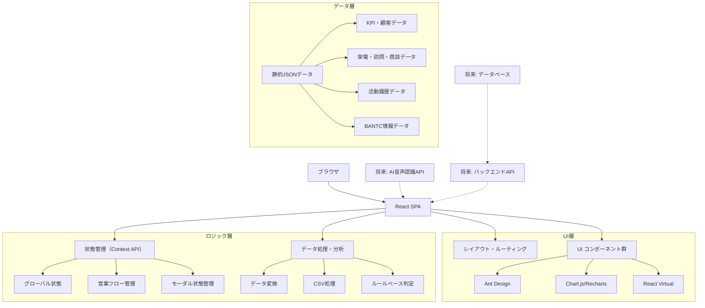
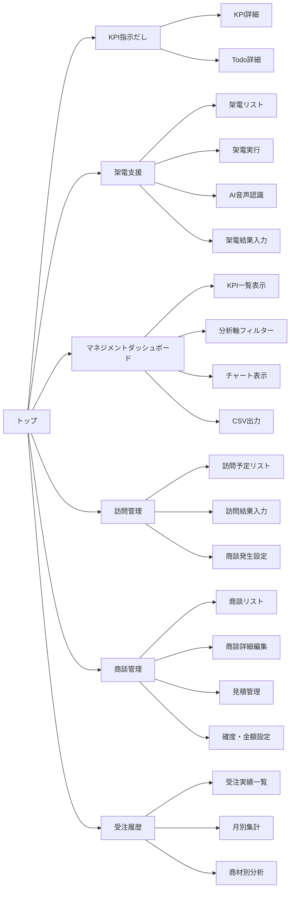

# 営業サポートAI フロントエンド設計書 v3.0

**ドキュメント管理情報**
- 作成日：2025年1月24日
- 最終更新日：2025年1月24日
- バージョン：v3.0（実装状況反映版）
- 実装進捗：約85%完了
- 残り実装工数：8-16時間

---

## 📑 目次

1. [システム概要](#1-システム概要)
2. [技術スタック](#2-技術スタック)
3. [アーキテクチャ設計](#3-アーキテクチャ設計)
4. [画面遷移・SiteMap](#4-画面遷移sitemap)
5. [ディレクトリ構成](#5-ディレクトリ構成)
6. [コンポーネント設計](#6-コンポーネント設計)
7. [コンポーネント仕様表](#7-コンポーネント仕様表)
8. [モックデータ戦略](#8-モックデータ戦略)
9. [データ構造設計](#9-データ構造設計)
10. [実装手順](#10-実装手順10分)
11. [ビルド最適化](#11-ビルド最適化)
12. [デモ用環境設定](#12-デモ用環境設定)
13. [パフォーマンス最適化](#13-パフォーマンス最適化)
14. [デプロイ準備](#14-デプロイ準備)

---

## 1. システム概要

### 1.1 設計思想
**行動KPIにとがらせたAI**の思想を技術的に実現し、営業フロー全体を一気通貫で管理するフロントエンド設計
- **指示だし**: KGI→KPI→Daily ToDoの階層的データ構造
- **補助輪**: UI/UXによる入力・思考時間の極小化
- **一気通貫管理**: 架電→訪問→商談→受注の営業フロー統合
- **マネジメント支援**: 10項目KPIの多軸分析とレポート機能

### 1.2 実装状況（約85%完了）

#### ✅ **実装完了機能**
- **KPIダッシュボード**: 完全実装済み
- **架電支援機能**: 詳細機能まで完全実装済み
  - 架電結果項目（固定選択）+ 自由記入 ✅
  - ポップアップ形式での詳細表示 ✅
  - BANTC情報入力（AIたたき台+自由記入） ✅
  - 活動履歴の時系列表示 ✅
- **訪問管理機能**: 完全実装済み
- **マネジメントダッシュボード**: 10項目KPI分析完全実装済み

#### 🔄 **残り実装項目**
- **商談専用画面**: KPIは実装済み、専用UI未実装
- **受注専用画面**: KPIは実装済み、専用UI未実装
- **データフロー自動連携**: 部分実装
- **パフォーマンス最適化**: 未実装

---

## 2. 技術スタック

### 2.1 開発環境（実装済み）
```powershell
# プロジェクトセットアップ
cd sales-ai-mock

# 依存関係インストール
npm install

# 開発サーバー起動
npm run dev
```

### 2.2 依存関係（実装済み）
```json
{
  "dependencies": {
    "react": "^19.1.0",
    "react-dom": "^19.1.0",
    "antd": "^5.26.6",
    "@ant-design/icons": "^6.0.0",
    "chart.js": "^4.5.0",
    "react-chartjs-2": "^5.3.0",
    "react-router-dom": "^7.7.0",
    "dayjs": "^1.11.13"
  },
  "devDependencies": {
    "@types/react": "^19.1.8",
    "@types/react-dom": "^19.1.6",
    "@typescript-eslint/eslint-plugin": "^8.38.0",
    "@typescript-eslint/parser": "^8.38.0",
    "typescript": "~5.8.3",
    "vite": "^7.0.4",
    "eslint": "^9.30.1",
    "prettier": "^3.6.2",
    "husky": "^9.1.7",
    "lint-staged": "^16.1.2"
  }
}
```

### 2.3 技術選定理由（機能拡張版）
| 技術 | 理由 | 代替案 | 用途 |
|------|------|--------|------|
| **Vite** | 爆速ビルド・HMR | Create React App（遅い） | 開発環境 |
| **Ant Design** | 豊富なコンポーネント、即使用可能 | Material-UI（セットアップ重い） | UI Framework |
| **Chart.js + Recharts** | 軽量＋高機能チャート | D3.js（複雑） | データ可視化 |
| **TypeScript** | 型安全性、開発効率向上 | JavaScript（型エラーリスク） | 開発言語 |
| **dayjs** | 軽量な日時ライブラリ | moment.js（重い） | 日時操作 |
| **papaparse** | CSV解析・生成 | 自作（開発コスト高） | CSV処理 |
| **React Virtual** | 大量データ仮想化 | 手動実装（複雑） | パフォーマンス |

---

## 3. アーキテクチャ設計

### 3.1 機能拡張版アーキテクチャ


---

## 4. 画面遷移・SiteMap

### 4.1 機能拡張版ページ遷移図


### 4.2 機能拡張版画面状態管理
| 画面 | 主要な状態 | ローディング | エラー処理 |
|------|------------|--------------|------------|
| KPI指示だし | KPI達成率、ToDoリスト | スケルトン表示 | データ取得失敗時の代替表示 |
| 架電支援 | 架電リスト、AI判定結果 | テーブルローディング | 空リスト時のEmptyState |
| マネジメント | フィルター条件、KPI一覧 | チャートローディング | 権限エラー・データなし |
| 訪問管理 | 訪問リスト、選択中訪問 | リストローディング | 空リスト時のEmptyState |
| 商談管理 | 商談リスト、編集状態 | テーブルローディング | 保存エラー・バリデーション |
| 受注履歴 | 受注データ、集計結果 | 統計ローディング | データ不整合・集計エラー |

---

## 5. ディレクトリ構成（機能拡張版）

```
sales-ai-mock/
├── src/
│   ├── components/           # UIコンポーネント
│   │   ├── layout/
│   │   │   ├── AppLayout.tsx
│   │   │   └── Navigation.tsx
│   │   ├── kpi/
│   │   │   ├── KPIOverview.tsx
│   │   │   ├── TodoList.tsx
│   │   │   └── NextAction.tsx
│   │   ├── call/
│   │   │   ├── CallList.tsx
│   │   │   ├── CallButton.tsx
│   │   │   ├── ReferenceInfo.tsx
│   │   │   └── CallForm.tsx
│   │   ├── management/       # 新規：マネジメント機能
│   │   │   ├── KPIGrid.tsx
│   │   │   ├── AnalysisFilter.tsx
│   │   │   ├── KPITrendChart.tsx
│   │   │   └── ReportExport.tsx
│   │   ├── visit/            # 新規：訪問管理
│   │   │   ├── VisitList.tsx
│   │   │   ├── VisitForm.tsx
│   │   │   └── VisitResult.tsx
│   │   ├── negotiation/      # 新規：商談管理
│   │   │   ├── NegotiationList.tsx
│   │   │   ├── NegotiationDetail.tsx
│   │   │   ├── EstimateForm.tsx
│   │   │   └── ProbabilitySlider.tsx
│   │   ├── order/            # 新規：受注管理
│   │   │   ├── OrderList.tsx
│   │   │   ├── OrderStatistics.tsx
│   │   │   └── ProductAnalysis.tsx
│   │   ├── voice/            # 新規：AI音声認識
│   │   │   ├── VoiceRecorder.tsx
│   │   │   ├── TranscriptDisplay.tsx
│   │   │   ├── AIJudgment.tsx
│   │   │   └── JudgmentCorrection.tsx
│   │   └── common/           # 共通コンポーネント
│   │       ├── PriorityTag.tsx
│   │       ├── StatusBadge.tsx
│   │       ├── LoadingState.tsx
│   │       └── ErrorBoundary.tsx
│   ├── contexts/             # 新規：状態管理
│   │   ├── AppContext.tsx
│   │   ├── UserContext.tsx
│   │   └── FlowContext.tsx
│   ├── data/                 # モックデータ
│   │   ├── kpiData.json
│   │   ├── callListData.json
│   │   └── customerData.json
│   ├── pages/                # ページコンポーネント
│   │   ├── KPIDashboard.tsx
│   │   ├── CallSupport.tsx
│   │   ├── CustomerList.tsx
│   │   └── Reports.tsx
│   ├── types/                # 型定義
│   │   └── index.ts
│   ├── utils/                # ユーティリティ
│   │   └── helpers.ts
│   ├── App.tsx
│   ├── main.tsx
│   └── index.css
├── public/
├── dist/                     # ビルド成果物（.gitignore対象）
├── package.json
└── vite.config.ts
```

---

## 6. コンポーネント設計

### 6.1 KPI指示だし画面

#### 6.1.1 KPIOverview.tsx
```tsx
import { Row, Col, Progress, Statistic, Card } from 'antd';

interface KPIData {
  kgi: { target: number; current: number; rate: number };
  kpi: {
    calls: { target: number; actual: number };
    appointments: { target: number; actual: number };
    proposals: { target: number; actual: number };
  };
}

export const KPIOverview: React.FC<{ data: KPIData }> = ({ data }) => {
  return (
    <Row gutter={16}>
      {/* KGI表示 */}
      <Col span={24}>
        <Card title="売上目標達成率">
          <Progress 
            percent={data.kgi.rate} 
            format={() => `${data.kgi.current.toLocaleString()}円 / ${data.kgi.target.toLocaleString()}円`}
          />
        </Card>
      </Col>
      
      {/* KPI表示 */}
      <Col span={8}>
        <Statistic 
          title="架電" 
          value={data.kpi.calls.actual} 
          suffix={`/ ${data.kpi.calls.target}`}
          valueStyle={{ color: data.kpi.calls.actual >= data.kpi.calls.target ? '#3f8600' : '#cf1322' }}
        />
      </Col>
      <Col span={8}>
        <Statistic 
          title="アポ獲得" 
          value={data.kpi.appointments.actual} 
          suffix={`/ ${data.kpi.appointments.target}`}
          valueStyle={{ color: data.kpi.appointments.actual >= data.kpi.appointments.target ? '#3f8600' : '#cf1322' }}
        />
      </Col>
      <Col span={8}>
        <Statistic 
          title="提案" 
          value={data.kpi.proposals.actual} 
          suffix={`/ ${data.kpi.proposals.target}`}
          valueStyle={{ color: data.kpi.proposals.actual >= data.kpi.proposals.target ? '#3f8600' : '#cf1322' }}
        />
      </Col>
    </Row>
  );
};
```

#### 6.1.2 TodoList.tsx
```tsx
import { List, Badge, Button } from 'antd';
import { CheckOutlined } from '@ant-design/icons';

interface TodoItem {
  id: number;
  action: string;
  priority: 'high' | 'medium' | 'low';
  status: 'pending' | 'completed';
}

export const TodoList: React.FC<{ todos: TodoItem[] }> = ({ todos }) => {
  const priorityColors = {
    high: 'red',
    medium: 'orange',
    low: 'blue'
  };

  return (
    <List
      header={<h3>今日のToDo</h3>}
      dataSource={todos}
      renderItem={(item) => (
        <List.Item
          actions={[
            <Button 
              type={item.status === 'completed' ? 'default' : 'primary'}
              icon={<CheckOutlined />}
              size="small"
            >
              {item.status === 'completed' ? '完了' : '実行'}
            </Button>
          ]}
        >
          <Badge color={priorityColors[item.priority]} />
          <span style={{ textDecoration: item.status === 'completed' ? 'line-through' : 'none' }}>
            {item.action}
          </span>
        </List.Item>
      )}
    />
  );
};
```

#### 6.1.3 NextAction.tsx
```tsx
import { Alert, Button } from 'antd';
import { ExclamationCircleOutlined } from '@ant-design/icons';

interface NextActionProps {
  message: string;
  type: 'warning' | 'error' | 'success';
  action?: string;
}

export const NextAction: React.FC<NextActionProps> = ({ message, type, action }) => {
  return (
    <Alert
      message="次にやること"
      description={
        <div>
          <p>{message}</p>
          {action && (
            <Button type="primary" icon={<ExclamationCircleOutlined />}>
              {action}
            </Button>
          )}
        </div>
      }
      type={type}
      showIcon
    />
  );
};
```

### 6.2 架電支援画面

#### 6.2.1 CallList.tsx
```tsx
import { Table, Button, Badge, Tag } from 'antd';
import { PhoneOutlined } from '@ant-design/icons';

interface CallItem {
  id: number;
  companyName: string;
  contactName: string;
  phoneNumber: string;
  priority: number;
  lastContact: string;
  industry: string;
}

export const CallList: React.FC<{ data: CallItem[] }> = ({ data }) => {
  const columns = [
    {
      title: '優先度',
      dataIndex: 'priority',
      key: 'priority',
      render: (priority: number) => (
        <Badge count={priority} style={{ backgroundColor: priority <= 3 ? '#f50' : '#108ee9' }} />
      ),
      width: 80,
    },
    {
      title: '企業名',
      dataIndex: 'companyName',
      key: 'companyName',
    },
    {
      title: '担当者',
      dataIndex: 'contactName',
      key: 'contactName',
    },
    {
      title: '電話番号',
      dataIndex: 'phoneNumber',
      key: 'phoneNumber',
      render: (phone: string) => (
        <Button type="link" icon={<PhoneOutlined />} onClick={() => window.open(`tel:${phone}`)}>
          {phone}
        </Button>
      ),
    },
    {
      title: '業界',
      dataIndex: 'industry',
      key: 'industry',
      render: (industry: string) => <Tag>{industry}</Tag>,
    },
    {
      title: '最終接触',
      dataIndex: 'lastContact',
      key: 'lastContact',
    },
    {
      title: '操作',
      key: 'action',
      render: (_, record: CallItem) => (
        <Button type="primary" icon={<PhoneOutlined />} size="small">
          架電
        </Button>
      ),
    },
  ];

  return (
    <Table
      columns={columns}
      dataSource={data}
      rowKey="id"
      pagination={{ pageSize: 10 }}
      size="small"
    />
  );
};
```

#### 6.2.2 ReferenceInfo.tsx
```tsx
import { Descriptions, Tag, Card } from 'antd';

interface ReferenceData {
  companyName: string;
  pastProducts: string[];
  lastContact: string;
  trendInfo: string;
  keyPersons: string[];
}

export const ReferenceInfo: React.FC<{ data: ReferenceData }> = ({ data }) => {
  return (
    <Card title="参照情報" size="small">
      <Descriptions column={1} size="small">
        <Descriptions.Item label="過去購入製品">
          {data.pastProducts.map(product => <Tag key={product}>{product}</Tag>)}
        </Descriptions.Item>
        <Descriptions.Item label="最終接触日">
          {data.lastContact}
        </Descriptions.Item>
        <Descriptions.Item label="業界トレンド">
          {data.trendInfo}
        </Descriptions.Item>
        <Descriptions.Item label="キーパーソン">
          {data.keyPersons.map(person => <Tag color="blue" key={person}>{person}</Tag>)}
        </Descriptions.Item>
      </Descriptions>
    </Card>
  );
};
```

---

## 7. コンポーネント仕様表

### 7.1 主要コンポーネント Props・Events リファレンス

| コンポーネント | Props | Events | 依存関係 |
|----------------|-------|--------|----------|
| **KPIOverview** | `data: KPIData` | - | antd (Progress, Statistic, Card) |
| **TodoList** | `todos: TodoItem[]` | `onTodoComplete: (id: number) => void` | antd (List, Badge, Button) |
| **NextAction** | `message: string, type: AlertType, action?: string` | `onActionClick?: () => void` | antd (Alert, Button) |
| **CallList** | `data: CallItem[], onCall: (id: number) => void` | `onCall` | antd (Table, Button, Badge) |
| **ReferenceInfo** | `data: ReferenceData` | - | antd (Descriptions, Tag, Card) |
| **CallForm** | `initialData?: CallFormData` | `onSubmit: (data: CallFormData) => void` | antd (Form, Input, Select) |

### 7.2 型定義クイックリファレンス
```tsx
// types/index.ts
export interface KPIData {
  kgi: { target: number; current: number; rate: number };
  kpi: {
    calls: { target: number; actual: number };
    appointments: { target: number; actual: number };
    proposals: { target: number; actual: number };
  };
}

export interface TodoItem {
  id: number;
  action: string;
  priority: 'high' | 'medium' | 'low';
  status: 'pending' | 'completed';
}

export interface CallItem {
  id: number;
  companyName: string;
  contactName: string;
  phoneNumber: string;
  priority: number;
  lastContact: string;
  industry: string;
}

export interface ReferenceData {
  companyName: string;
  pastProducts: string[];
  lastContact: string;
  trendInfo: string;
  keyPersons: string[];
}
```

---

## 8. モックデータ戦略

### 8.1 静的JSONデータ管理方針

#### 8.1.1 データファイル構成
```
src/data/
├── kpiData.json          # KPI・売上目標データ
├── callListData.json     # 架電先リストデータ
├── customerData.json     # 顧客詳細データ
├── reportsData.json      # レポート用データ
└── masterData.json       # マスタデータ（業界、優先度等）
```

#### 8.1.2 データ更新・メンテナンス方法
- **更新頻度**: デモ準備時のみ手動更新
- **データ品質**: 実際の営業活動に近いリアルなサンプルデータ
- **ファイルサイズ**: 各JSONファイル < 100KB（高速ロード）
- **文字エンコーディング**: UTF-8（日本語対応）

#### 8.1.3 本格実装時のAPI移行想定
```tsx
// モック版（現在）
import kpiData from '@/data/kpiData.json';

// 本格実装時（将来）
const kpiData = await fetch('/api/kpi').then(res => res.json());
```

### 8.2 サンプルデータ設計原則
- **リアリティ**: 実際の企業名・人名は避け、それらしいサンプル名を使用
- **多様性**: 業界・規模・地域のバリエーション豊富
- **ストーリー性**: 架電→アポ→提案の流れが追跡できるデータ
- **ダミー個人情報**: 電話番号等は明らかにダミーとわかる形式

---

## 9. データ構造設計

### 9.1 KPIデータ（src/data/kpiData.json）
```json
{
  "kgi": {
    "monthlyTarget": 5000000,
    "current": 3200000,
    "achievementRate": 64
  },
  "kpi": {
    "calls": { "target": 50, "actual": 32 },
    "appointments": { "target": 10, "actual": 6 },
    "proposals": { "target": 3, "actual": 2 }
  },
  "dailyTodos": [
    {
      "id": 1,
      "action": "A社に架電",
      "priority": "high",
      "status": "pending"
    },
    {
      "id": 2,
      "action": "B社への提案書作成",
      "priority": "medium",
      "status": "completed"
    }
  ],
  "nextAction": {
    "message": "架電件数が不足しています。残り18件の架電が必要です。",
    "type": "warning",
    "actionButton": "架電リストを確認"
  }
}
```

### 9.2 架電リストデータ（src/data/callListData.json）
```json
[
  {
    "id": 1,
    "companyName": "株式会社サンプル",
    "contactName": "田中太郎",
    "phoneNumber": "03-1234-5678",
    "priority": 1,
    "lastContact": "2025-01-05",
    "pastProducts": ["CRM導入支援"],
    "industry": "IT・ソフトウェア",
    "trendInfo": "DX推進予算増加中",
    "keyPersons": ["田中太郎（決裁者）", "佐藤花子（担当者）"]
  }
]
```

---

## 10. 実装手順（10分）

### 10.1 Phase 1: 環境構築（1.5分）
```bash
# 1. プロジェクト作成
npm create vite@latest sales-ai-mock -- --template react-ts

# 2. 依存関係インストール
cd sales-ai-mock
npm install antd @ant-design/icons chart.js react-chartjs-2 react-router-dom

# 3. 開発サーバー起動
npm run dev
```

### 10.2 Phase 2: 基本レイアウト（1.5分）
```tsx
// App.tsx - 基本レイアウト設定
import { Layout, Menu } from 'antd';
import { DashboardOutlined, PhoneOutlined } from '@ant-design/icons';

const { Sider, Header, Content } = Layout;

const App = () => {
  const menuItems = [
    { key: 'kpi', icon: <DashboardOutlined />, label: 'KPI指示だし' },
    { key: 'call', icon: <PhoneOutlined />, label: '架電支援' },
  ];

  return (
    <Layout style={{ minHeight: '100vh' }}>
      <Sider>
        <Menu theme="dark" mode="inline" items={menuItems} />
      </Sider>
      <Layout>
        <Header style={{ background: '#fff', padding: '0 16px' }}>
          <h1>営業サポートAI</h1>
        </Header>
        <Content style={{ margin: '16px', padding: '16px', background: '#fff' }}>
          {/* ページコンテンツ */}
        </Content>
      </Layout>
    </Layout>
  );
};
```

### 10.3 Phase 3: KPI指示だし画面（3.5分）
1. **モックデータ作成** (0.5分)
2. **KPIOverview コンポーネント** (1分)
3. **TodoList コンポーネント** (1分)
4. **NextAction コンポーネント** (1分)

### 10.4 Phase 4: 架電支援画面（3.5分）
1. **架電リストデータ作成** (0.5分)
2. **CallList コンポーネント** (1.5分)
3. **ReferenceInfo コンポーネント** (1分)
4. **画面統合** (0.5分)

---

## 11. ビルド最適化

### 11.1 Vite設定（vite.config.ts）
```typescript
import { defineConfig } from 'vite';
import react from '@vitejs/plugin-react';

export default defineConfig({
  plugins: [react()],
  build: {
    rollupOptions: {
      output: {
        manualChunks: {
          vendor: ['react', 'react-dom'],
          antd: ['antd', '@ant-design/icons'],
          charts: ['chart.js', 'react-chartjs-2']
        }
      }
    },
    chunkSizeWarningLimit: 1000
  },
  optimizeDeps: {
    include: ['antd', '@ant-design/icons']
  }
});
```

### 11.2 バンドルサイズ最適化
- **Tree Shaking**: Ant Design の未使用コンポーネント除外
- **Code Splitting**: vendor, antd, charts に分割
- **Dynamic Import**: ページコンポーネントの遅延読み込み

---

## 12. デモ用環境設定

### 12.1 機能拡張版開発サーバー設定
```json
// package.json（機能拡張版）
{
  "scripts": {
    "dev": "vite --host 0.0.0.0 --port 5173",
    "build": "tsc && vite build",
    "preview": "vite preview --host 0.0.0.0 --port 5173",
    "serve": "npm run build && npm run preview",
    "test": "vitest",
    "lint": "eslint src --ext ts,tsx"
  }
}
```

### 12.2 機能拡張版環境構築手順
```bash
# 1. 依存関係インストール
npm install

# 2. 開発サーバー起動
npm run dev

# 3. 機能テスト実行
npm run test

# 4. ビルド確認
npm run build && npm run preview
```

### 12.3 デモ・評価環境設定
- **推奨解像度**: 1920x1080 (Full HD)
- **対象ブラウザ**: Chrome, Edge, Safari最新版
- **権限設定**: 営業担当者・マネージャー2つのテストアカウント
- **データ**: 1年分のサンプルデータ（約1000件）

---

## 13. パフォーマンス最適化

### 13.1 機能拡張版パフォーマンス最適化
- **Vite**: ESBuild による高速ビルド
- **React Virtual**: 大量データ表示の仮想化
- **React.memo**: コンポーネントメモ化
- **Code Splitting**: 機能単位での分割読み込み
- **Context最適化**: 状態更新の局所化

### 13.2 パフォーマンス目標（機能拡張版）
- **初期ロード**: < 3秒（1MB以下）
- **操作レスポンス**: < 1秒
- **大量データ表示**: 1000件以上でも快適動作
- **メモリ使用量**: < 200MB

---

## 14. デプロイ準備

### 14.1 機能拡張版ビルド & デプロイ
```bash
# 開発版ビルド
npm run build

# 本番環境向けビルド
npm run build -- --mode production

# プレビュー確認
npm run preview

# 段階的デプロイ
npm run deploy:staging  # ステージング環境
npm run deploy:prod     # 本番環境
```

### 14.2 機能拡張版の特徴
- **一気通貫営業フロー**: 架電→訪問→商談→受注の統合管理
- **AI音声認識**: 自動的な通話内容分析と判定
- **権限管理**: 営業担当者・マネージャーのロールベースアクセス
- **マネジメント分析**: 10項目KPIの多軸分析
- **リアルタイム連携**: 工程間の自動データ連携

### 14.3 本格実装への移行準備
- **バックエンドAPI**: 音声認識・データ分析API連携
- **データベース**: 営業データの永続化・履歴管理
- **認証システム**: 企業ユーザー認証・セキュリティ強化
- **スケーラビリティ**: 大規模ユーザー・データ対応

---

**設計書管理情報**
- 作成日：2025年1月24日
- 最終更新日：2025年1月24日
- バージョン：v2.0（機能拡張版）
- 対象：機能拡張版フロントエンド（フルバージョン）
- 想定実装時間：38時間（1ヶ月以内）
- 実装優先度：Phase 7→8→9→10→11
- 次回見直し予定：機能拡張版完了時

**更新履歴**
| 日付 | バージョン | 更新内容 | 更新者 |
|------|------------|----------|--------|
| 2025/01/24 | v1.0 | 初版作成（モック版） | システム設計チーム |
| 2025/01/24 | v2.0 | 機能拡張版対応（AI音声認識・営業フロー統合・マネジメント機能追加） | システム設計チーム |

**関連ドキュメント**
- [004_requirements_mock.md](./004_requirements_mock.md) - 要件定義書
- [002_database_design.md](./002_database_design.md) - データベース設計書
- [005_ui_design.md](./005_ui_design.md) - 画面設計書
- [006_demo_guide.md](./006_demo_guide.md) - デモ・評価手順書 