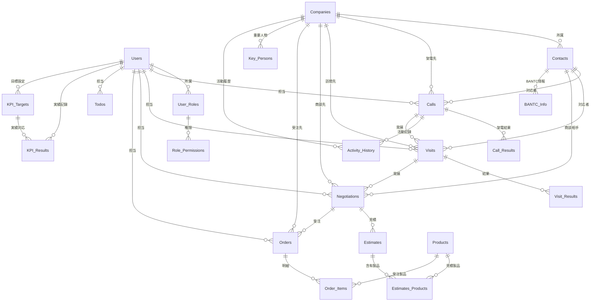

# 営業サポートAI データ構造設計書 v3.0

**ドキュメント管理情報**
- 作成日：2025年1月24日
- 最終更新日：2025年1月24日
- バージョン：v3.0（実装状況反映版）
- 対象：JSONモックデータ構造
- 実装進捗：約85%完了

---

## 📑 目次

1. [概要](#1-概要)
2. [実装済みデータファイル](#2-実装済みデータファイル)
3. [JSONデータ構造](#3-jsonデータ構造)
4. [型定義（TypeScript）](#4-型定義typescript)
5. [データ関連性](#5-データ関連性)
6. [将来のデータベース移行](#6-将来のデータベース移行)

---

## 1. 概要

営業サポートAIシステムの現在の実装では、JSONファイルベースのモックデータを使用しています。本ドキュメントでは、実装済みのデータ構造と型定義について説明します。

### 1.1 設計方針
- **モック実装**: JSONファイルによる静的データ
- **型安全性**: TypeScriptによる厳密な型定義
- **実用性**: 実際の営業現場を想定したリアルなデータ構造
- **拡張性**: 将来のデータベース移行を考慮した設計
- **一気通貫**: 架電→訪問→商談→受注の営業フロー連携

---

## 2. 実装済みデータファイル

### 2.1 データファイル一覧
```
sales-ai-mock/src/data/
├── kpiData.json          # KPI・ToDo・NextAction
├── callListData.json     # 架電リスト・企業情報
├── activityHistory.json  # 活動履歴（next_order.md準拠）
├── visitData.json        # 訪問スケジュール・実績
└── managementData.json   # マネジメントKPI分析データ
```

### 2.2 型定義ファイル
```
sales-ai-mock/src/types/
├── index.ts              # 基本型定義
├── call.ts               # 架電・活動履歴関連
├── visit.ts              # 訪問関連
└── analytics.ts          # KPI分析関連
```

---

## 3. JSONデータ構造

### 2.1 全体ER図（機能拡張版）


### 2.2 機能拡張版エンティティ関係
```mermaid
erDiagram
    Users {
        varchar user_id PK
        varchar name
        varchar email UK
        varchar department
        enum role
        timestamp created_at
        timestamp updated_at
    }
    
    User_Roles {
        varchar role_id PK
        varchar role_name UK
        text description
    }
    
    Calls {
        varchar call_id PK
        varchar user_id FK
        varchar company_id FK
        varchar contact_id FK
        timestamp call_date
        enum call_type
        text summary
        enum outcome
        enum priority
        text notes
        boolean has_transcript
        boolean ai_judged
    }
    
    Call_Results {
        varchar result_id PK
        varchar call_id FK
        enum result_type
        text notes
        boolean auto_generated
        timestamp created_at
        timestamp updated_at
    }
    
    Activity_History {
        varchar activity_id PK
        varchar company_id FK
        varchar contact_id FK
        varchar user_id FK
        enum activity_type
        timestamp activity_date
        enum result_type
        text notes
        text summary
        text details
        enum status
    }
    
    BANTC_Info {
        varchar bantc_id PK
        varchar contact_id FK
        varchar company_id FK
        text budget_info
        text authority_info
        text need_info
        text timeline_info
        text competition_info
        boolean ai_generated
        timestamp updated_at
    }
        boolean human_verified
        text correction_note
        timestamp created_at
    }
    
    Visits {
        varchar visit_id PK
        varchar call_id FK
        varchar user_id FK
        varchar company_id FK
        varchar contact_id FK
        timestamp scheduled_date
        timestamp actual_date
        enum visit_status
        text purpose
        text location
    }
    
    Negotiations {
        varchar negotiation_id PK
        varchar visit_id FK
        varchar user_id FK
        varchar company_id FK
        timestamp negotiation_date
        enum negotiation_status
        decimal probability_percent
        decimal estimated_amount
        text requirements
        timestamp expected_close_date
    }
    
    Orders {
        varchar order_id PK
        varchar negotiation_id FK
        varchar user_id FK
        varchar company_id FK
        timestamp order_date
        decimal total_amount
        enum order_status
        text notes
    }
```

---

## 3. ENUM値・マスタ定義

### 3.1 機能拡張版ENUM値一覧表

#### 3.1.1 ユーザー・権限系
| ENUM名 | 値 | 意味 | 表示名 | 備考 |
|--------|-----|------|--------|------|
| **user_role** | `sales` | 営業担当者 | 営業 | 個人データのみ閲覧 |
| | `manager` | マネージャー | 管理者 | 全社データ閲覧可能 |
| | `admin` | システム管理者 | 管理者 | システム設定権限 |

#### 3.1.2 AI判定・音声認識系
| ENUM名 | 値 | 意味 | 表示名 | 備考 |
|--------|-----|------|--------|------|
| **ai_judgment_type** | `connection` | 通電判定 | 通電 | 電話がつながったか |
| | `appointment` | アポ獲得判定 | アポ | 次回約束ができたか |
| | `interest` | 興味度判定 | 興味 | 商品への関心度 |
| | `urgency` | 緊急度判定 | 緊急度 | 案件の緊急性 |

#### 3.1.3 営業活動・顧客系
| ENUM名 | 値 | 意味 | 表示名 | 備考 |
|--------|-----|------|--------|------|
| **call_outcome** | `connected` | 通電 | 通電 | 担当者と会話 |
| | `no_answer` | 不在 | 不在 | 担当者不在 |
| | `busy` | 話中 | 話中 | 電話中・会議中 |
| | `refused` | 拒否 | 拒否 | 営業拒否 |
| | `wrong_number` | 番号違い | 番号違い | 間違い電話 |

| ENUM名 | 値 | 意味 | 表示名 | 備考 |
|--------|-----|------|--------|------|
| **company_status** | `new` | 新規見込み客 | 新規 | 初回接触前 |
| | `negotiating` | 商談中 | 商談中 | アクティブな案件 |
| | `proposal` | 提案提出済み | 提案中 | 提案書提出後 |
| | `closed_won` | 受注 | 受注 | 成約済み |
| | `closed_lost` | 失注 | 失注 | 案件終了 |
| | `dormant` | 休眠 | 休眠 | 長期間接触なし |

| ENUM名 | 値 | 意味 | 表示名 | 備考 |
|--------|-----|------|--------|------|
| **priority_level** | `high` | 高優先度 | 高 | 緊急・重要 |
| | `medium` | 中優先度 | 中 | 通常 |
| | `low` | 低優先度 | 低 | 後回し可能 |

#### 3.1.4 訪問管理系
| ENUM名 | 値 | 意味 | 表示名 | 備考 |
|--------|-----|------|--------|------|
| **visit_status** | `scheduled` | 予定 | 予定 | 訪問予定 |
| | `completed` | 完了 | 完了 | 訪問完了 |
| | `cancelled` | キャンセル | 中止 | 訪問中止 |
| | `rescheduled` | 再調整 | 再調整 | 日程変更 |

#### 3.1.5 商談管理系
| ENUM名 | 値 | 意味 | 表示名 | 備考 |
|--------|-----|------|--------|------|
| **negotiation_status** | `active` | 進行中 | 進行中 | アクティブな商談 |
| | `estimate_sent` | 見積提出 | 見積中 | 見積書提出済み |
| | `under_review` | 検討中 | 検討中 | 先方検討中 |
| | `negotiating` | 条件調整 | 調整中 | 価格・条件交渉中 |
| | `closed_won` | 受注 | 受注 | 成約 |
| | `closed_lost` | 失注 | 失注 | 失注 |
| | `postponed` | 延期 | 延期 | 時期延期 |

#### 3.1.6 受注管理系
| ENUM名 | 値 | 意味 | 表示名 | 備考 |
|--------|-----|------|--------|------|
| **order_status** | `received` | 受注 | 受注 | 注文受付 |
| | `confirmed` | 確定 | 確定 | 注文確定 |
| | `in_production` | 製造中 | 製造中 | 製造・準備中 |
| | `shipped` | 出荷済み | 出荷済み | 出荷完了 |
| | `delivered` | 納品済み | 納品済み | 納品完了 |
| | `cancelled` | キャンセル | キャンセル | 注文取消 |

| ENUM名 | 値 | 意味 | 表示名 | 備考 |
|--------|-----|------|--------|------|
| **decision_power** | `high` | 決裁権限あり | 決裁者 | 最終決定権 |
| | `medium` | 影響力あり | 影響者 | 決定に影響 |
| | `low` | 情報収集者 | 担当者 | 窓口レベル |

| ENUM名 | 値 | 意味 | 表示名 | 備考 |
|--------|-----|------|--------|------|
| **call_type** | `outbound` | 発信 | 架電 | こちらから発信 |
| | `inbound` | 着信 | 着電 | 先方から着信 |

| ENUM名 | 値 | 意味 | 表示名 | 備考 |
|--------|-----|------|--------|------|
| **meeting_type** | `face_to_face` | 対面 | 対面 | 訪問・来社 |
| | `online` | オンライン | Web | Teams/Zoom等 |
| | `phone` | 電話 | 電話 | 音声のみ |

| ENUM名 | 値 | 意味 | 表示名 | 備考 |
|--------|-----|------|--------|------|
| **appointment_status** | `scheduled` | 予定 | 予定 | 未実施 |
| | `completed` | 完了 | 完了 | 実施済み |
| | `cancelled` | キャンセル | 中止 | 中止・延期 |

| ENUM名 | 値 | 意味 | 表示名 | 備考 |
|--------|-----|------|--------|------|
| **proposal_status** | `draft` | 下書き | 下書き | 作成中 |
| | `submitted` | 提出済み | 提出済み | 先方に送付 |
| | `accepted` | 承認 | 承認 | 先方が承認 |
| | `rejected` | 却下 | 却下 | 先方が却下 |
| | `expired` | 期限切れ | 期限切れ | 回答期限経過 |

| ENUM名 | 値 | 意味 | 表示名 | 備考 |
|--------|-----|------|--------|------|
| **activity_type** | `call` | 架電 | 架電 | 電話による営業活動 |
| | `visit` | 訪問 | 訪問 | 顧客訪問による営業活動 |
| | `estimate` | 見積 | 見積 | 見積書作成・提出 |
| | `negotiation` | 商談 | 商談 | 正式な商談・提案 |
| | `other` | その他 | その他 | 上記以外の活動 |

| ENUM名 | 値 | 意味 | 表示名 | 備考 |
|--------|-----|------|--------|------|
| **activity_result_type** | `called` | 架電済 | 架電済 | 架電活動：電話をかけた |
| | `connected` | 通電 | 通電 | 架電活動：担当者と通話 |
| | `appointment` | アポ獲得 | アポ獲得 | 架電活動：次回約束獲得 |
| | `absent` | 不在 | 不在 | 架電活動：担当者不在 |
| | `refused` | 拒否 | 拒否 | 架電活動：営業拒否 |
| | `visit_success` | 訪問成功 | 成功 | 訪問活動：訪問成功 |
| | `visit_partial` | 一部成功 | 一部成功 | 訪問活動：部分的成功 |
| | `visit_failed` | 訪問失敗 | 失敗 | 訪問活動：訪問失敗 |
| | `visit_reschedule` | 再訪問 | 再訪問必要 | 訪問活動：再訪問が必要 |
| | `estimate_draft` | 見積下書き | 下書き | 見積活動：作成中 |
| | `estimate_submitted` | 見積提出 | 提出済み | 見積活動：先方に送付 |
| | `estimate_accepted` | 見積承認 | 承認 | 見積活動：先方が承認 |
| | `estimate_rejected` | 見積却下 | 却下 | 見積活動：先方が却下 |
| | `estimate_expired` | 見積期限切れ | 期限切れ | 見積活動：回答期限経過 |
| | `negotiation_active` | 商談進行中 | 進行中 | 商談活動：アクティブな商談 |
| | `negotiation_estimate` | 商談見積提出 | 見積提出 | 商談活動：見積書提出済み |
| | `negotiation_review` | 商談検討中 | 検討中 | 商談活動：先方検討中 |
| | `negotiation_adjust` | 条件調整 | 条件調整 | 商談活動：価格・条件交渉中 |
| | `negotiation_won` | 商談受注 | 受注 | 商談活動：成約 |
| | `negotiation_lost` | 商談失注 | 失注 | 商談活動：失注 |
| | `other_result` | その他結果 | その他 | その他活動の結果 |

| ENUM名 | 値 | 意味 | 表示名 | 備考 |
|--------|-----|------|--------|------|
| **action_type** | `call` | 架電 | 架電 | 電話をかける |
| | `appointment` | アポ | アポ | 商談設定 |
| | `proposal` | 提案 | 提案 | 提案書作成 |
| | `follow_up` | フォロー | フォロー | 追跡・確認 |
| | `other` | その他 | その他 | 上記以外 |

### 3.2 業界分類マスタ
| 分類コード | 業界名 | 表示名 | 備考 |
|------------|--------|--------|------|
| `IT001` | IT・ソフトウェア | IT | システム開発等 |
| `FIN001` | 金融・保険 | 金融 | 銀行・証券等 |
| `MFG001` | 製造業 | 製造 | 自動車・機械等 |
| `RTL001` | 小売・卸売 | 小売 | 流通・EC等 |
| `SVC001` | サービス業 | サービス | コンサル・人材等 |
| `EDU001` | 教育・研究 | 教育 | 学校・研究機関 |
| `MED001` | 医療・福祉 | 医療 | 病院・介護等 |
| `GOV001` | 官公庁・公的機関 | 官公庁 | 自治体・公益法人 |

---

## 4. 参照整合性・制約方針

### 4.1 外部キー制約・削除時動作
| 親テーブル | 子テーブル | 削除時動作 | 理由 |
|------------|------------|------------|------|
| Users | Calls | RESTRICT | 営業担当者削除時は通話記録保持 |
| Users | Appointments | RESTRICT | 営業担当者削除時は商談記録保持 |
| Users | Proposals | RESTRICT | 営業担当者削除時は提案書保持 |
| Users | Todos | CASCADE | 営業担当者削除時はToDo削除 |
| Companies | Contacts | CASCADE | 企業削除時は担当者も削除 |
| Companies | Calls | RESTRICT | 企業削除時は通話記録保持 |
| Contacts | Calls | SET NULL | 担当者削除時は通話記録のcontact_idをNULL |
| Appointments | Proposals | SET NULL | 商談削除時は提案書のappointment_idをNULL |
| Products | Proposal_Products | RESTRICT | 製品削除時は提案書製品保持 |

### 4.2 NULL許可方針
| フィールド分類 | NULL許可 | 理由 |
|----------------|----------|------|
| 主キー（PK） | NOT NULL | 必須（制約） |
| 外部キー（FK） | 一部許可 | 関連が任意の場合のみ |
| 必須属性 | NOT NULL | ビジネス上必須項目 |
| 任意属性 | NULL許可 | 入力が任意の項目 |
| 日時系 | NOT NULL | 記録の整合性確保 |

### 4.3 CHECK制約例
```sql
-- 優先度は1-5の範囲
ALTER TABLE Contacts ADD CONSTRAINT chk_priority_level 
CHECK (priority_level BETWEEN 1 AND 5);

-- 提案金額は正数
ALTER TABLE Proposals ADD CONSTRAINT chk_amount_positive 
CHECK (amount > 0);

-- 回答期限は提案日以降
ALTER TABLE Proposals ADD CONSTRAINT chk_deadline_after_proposal 
CHECK (response_deadline >= proposal_date);

-- 完了日時は作成日時以降
ALTER TABLE Todos ADD CONSTRAINT chk_completed_after_created 
CHECK (completed_at >= created_at OR completed_at IS NULL);
```

---

## 5. エンティティ詳細設計

### 5.1 ユーザー管理系

#### Users（営業担当者）
営業システムを利用する営業スタッフの基本情報を管理

```sql
CREATE TABLE Users (
    user_id VARCHAR(50) PRIMARY KEY,
    name VARCHAR(100) NOT NULL,
    email VARCHAR(255) NOT NULL UNIQUE,
    department VARCHAR(50) NOT NULL,
    role VARCHAR(50) NOT NULL,
    is_active BOOLEAN NOT NULL DEFAULT TRUE,
    created_at TIMESTAMP NOT NULL DEFAULT CURRENT_TIMESTAMP,
    updated_at TIMESTAMP NOT NULL DEFAULT CURRENT_TIMESTAMP ON UPDATE CURRENT_TIMESTAMP,
    
    -- 制約
    CONSTRAINT chk_email_format CHECK (email LIKE '%@%'),
    CONSTRAINT chk_name_length CHECK (LENGTH(name) >= 2)
);

-- インデックス
CREATE INDEX idx_users_department ON Users(department);
CREATE INDEX idx_users_role ON Users(role);
CREATE INDEX idx_users_active ON Users(is_active);
```

| フィールド | 型 | 制約 | 説明 |
|---|---|---|---|
| user_id | VARCHAR(50) | PK, NOT NULL | 営業担当者の一意識別子 |
| name | VARCHAR(100) | NOT NULL | 担当者氏名 |
| email | VARCHAR(255) | NOT NULL, UNIQUE | メールアドレス |
| department | VARCHAR(50) | NOT NULL | 所属部署 |
| role | VARCHAR(50) | NOT NULL | 役職（営業、マネージャー等） |
| is_active | BOOLEAN | NOT NULL, DEFAULT TRUE | アクティブ状態 |
| created_at | TIMESTAMP | NOT NULL | 作成日時 |
| updated_at | TIMESTAMP | NOT NULL | 更新日時 |

---

### 5.2 顧客管理系

#### Companies（企業）
架電対象となる企業の基本情報を管理

```sql
CREATE TABLE Companies (
    company_id VARCHAR(50) PRIMARY KEY,
    company_name VARCHAR(200) NOT NULL,
    industry VARCHAR(100) NOT NULL,
    address TEXT,
    phone VARCHAR(20),
    status ENUM('new', 'negotiating', 'proposal', 'closed_won', 'closed_lost', 'dormant') 
           NOT NULL DEFAULT 'new',
    employee_count INTEGER,
    annual_revenue DECIMAL(15,2),
    website_url VARCHAR(500),
    notes TEXT,
    created_at TIMESTAMP NOT NULL DEFAULT CURRENT_TIMESTAMP,
    updated_at TIMESTAMP NOT NULL DEFAULT CURRENT_TIMESTAMP ON UPDATE CURRENT_TIMESTAMP,
    
    -- 制約
    CONSTRAINT chk_employee_count_positive CHECK (employee_count > 0 OR employee_count IS NULL),
    CONSTRAINT chk_revenue_positive CHECK (annual_revenue > 0 OR annual_revenue IS NULL)
);

-- インデックス
CREATE INDEX idx_companies_industry ON Companies(industry);
CREATE INDEX idx_companies_status ON Companies(status);
CREATE INDEX idx_companies_name ON Companies(company_name);
```

#### Contacts（連絡先）
企業内の担当者情報を管理

```sql
CREATE TABLE Contacts (
    contact_id VARCHAR(50) PRIMARY KEY,
    company_id VARCHAR(50) NOT NULL,
    name VARCHAR(100) NOT NULL,
    position VARCHAR(100),
    phone VARCHAR(20),
    email VARCHAR(255),
    decision_making_power ENUM('high', 'medium', 'low') NOT NULL DEFAULT 'low',
    notes TEXT,
    is_active BOOLEAN NOT NULL DEFAULT TRUE,
    created_at TIMESTAMP NOT NULL DEFAULT CURRENT_TIMESTAMP,
    updated_at TIMESTAMP NOT NULL DEFAULT CURRENT_TIMESTAMP ON UPDATE CURRENT_TIMESTAMP,
    
    -- 外部キー
    FOREIGN KEY (company_id) REFERENCES Companies(company_id) ON DELETE CASCADE,
    
    -- 制約
    CONSTRAINT chk_contact_email_format CHECK (email LIKE '%@%' OR email IS NULL)
);

-- インデックス
CREATE INDEX idx_contacts_company ON Contacts(company_id);
CREATE INDEX idx_contacts_decision_power ON Contacts(decision_making_power);
CREATE INDEX idx_contacts_active ON Contacts(is_active);
```

#### Key_Persons（キーパーソン）
企業内の重要人物情報を管理（Contactsの拡張情報）

```sql
CREATE TABLE Key_Persons (
    key_person_id VARCHAR(50) PRIMARY KEY,
    company_id VARCHAR(50) NOT NULL,
    contact_id VARCHAR(50),
    name VARCHAR(100) NOT NULL,
    position VARCHAR(100),
    decision_power ENUM('high', 'medium', 'low') NOT NULL DEFAULT 'medium',
    interests JSON,
    influence_areas TEXT,
    communication_style TEXT,
    notes TEXT,
    created_at TIMESTAMP NOT NULL DEFAULT CURRENT_TIMESTAMP,
    updated_at TIMESTAMP NOT NULL DEFAULT CURRENT_TIMESTAMP ON UPDATE CURRENT_TIMESTAMP,
    
    -- 外部キー
    FOREIGN KEY (company_id) REFERENCES Companies(company_id) ON DELETE CASCADE,
    FOREIGN KEY (contact_id) REFERENCES Contacts(contact_id) ON DELETE SET NULL
);

-- インデックス
CREATE INDEX idx_key_persons_company ON Key_Persons(company_id);
CREATE INDEX idx_key_persons_decision_power ON Key_Persons(decision_power);
```

---

### 5.3 営業活動系

#### Calls（通話記録）
架電履歴と結果を記録

```sql
CREATE TABLE Calls (
    call_id VARCHAR(50) PRIMARY KEY,
    user_id VARCHAR(50) NOT NULL,
    company_id VARCHAR(50) NOT NULL,
    contact_id VARCHAR(50),
    call_date TIMESTAMP NOT NULL,
    call_type ENUM('outbound', 'inbound') NOT NULL DEFAULT 'outbound',
    duration_minutes INTEGER,
    summary TEXT,
    outcome VARCHAR(100),
    priority ENUM('high', 'medium', 'low') NOT NULL DEFAULT 'medium',
    next_action TEXT,
    notes TEXT,
    created_at TIMESTAMP NOT NULL DEFAULT CURRENT_TIMESTAMP,
    updated_at TIMESTAMP NOT NULL DEFAULT CURRENT_TIMESTAMP ON UPDATE CURRENT_TIMESTAMP,
    
    -- 外部キー
    FOREIGN KEY (user_id) REFERENCES Users(user_id) ON DELETE RESTRICT,
    FOREIGN KEY (company_id) REFERENCES Companies(company_id) ON DELETE RESTRICT,
    FOREIGN KEY (contact_id) REFERENCES Contacts(contact_id) ON DELETE SET NULL,
    
    -- 制約
    CONSTRAINT chk_duration_positive CHECK (duration_minutes > 0 OR duration_minutes IS NULL),
    CONSTRAINT chk_call_date_not_future CHECK (call_date <= CURRENT_TIMESTAMP)
);

-- インデックス
CREATE INDEX idx_calls_user_date ON Calls(user_id, call_date);
CREATE INDEX idx_calls_company_date ON Calls(company_id, call_date);
CREATE INDEX idx_calls_priority ON Calls(priority);
CREATE INDEX idx_calls_outcome ON Calls(outcome);
```

#### Appointments（アポイントメント）
商談予定とその結果を管理

```sql
CREATE TABLE Appointments (
    appointment_id VARCHAR(50) PRIMARY KEY,
    user_id VARCHAR(50) NOT NULL,
    company_id VARCHAR(50) NOT NULL,
    contact_id VARCHAR(50),
    call_id VARCHAR(50),
    scheduled_date TIMESTAMP NOT NULL,
    duration_minutes INTEGER DEFAULT 60,
    meeting_type ENUM('face_to_face', 'online', 'phone') NOT NULL DEFAULT 'face_to_face',
    status ENUM('scheduled', 'completed', 'cancelled') NOT NULL DEFAULT 'scheduled',
    agenda TEXT,
    outcome TEXT,
    next_steps TEXT,
    meeting_location VARCHAR(500),
    meeting_url VARCHAR(500),
    notes TEXT,
    created_at TIMESTAMP NOT NULL DEFAULT CURRENT_TIMESTAMP,
    updated_at TIMESTAMP NOT NULL DEFAULT CURRENT_TIMESTAMP ON UPDATE CURRENT_TIMESTAMP,
    
    -- 外部キー
    FOREIGN KEY (user_id) REFERENCES Users(user_id) ON DELETE RESTRICT,
    FOREIGN KEY (company_id) REFERENCES Companies(company_id) ON DELETE RESTRICT,
    FOREIGN KEY (contact_id) REFERENCES Contacts(contact_id) ON DELETE SET NULL,
    FOREIGN KEY (call_id) REFERENCES Calls(call_id) ON DELETE SET NULL,
    
    -- 制約
    CONSTRAINT chk_duration_positive CHECK (duration_minutes > 0),
    CONSTRAINT chk_meeting_url_for_online CHECK (
        meeting_type != 'online' OR meeting_url IS NOT NULL
    )
);

-- インデックス
CREATE INDEX idx_appointments_user_date ON Appointments(user_id, scheduled_date);
CREATE INDEX idx_appointments_company_status ON Appointments(company_id, status);
CREATE INDEX idx_appointments_date_status ON Appointments(scheduled_date, status);
```

#### Proposals（提案書）
作成した提案書・見積書を管理

```sql
CREATE TABLE Proposals (
    proposal_id VARCHAR(50) PRIMARY KEY,
    user_id VARCHAR(50) NOT NULL,
    company_id VARCHAR(50) NOT NULL,
    appointment_id VARCHAR(50),
    title VARCHAR(200) NOT NULL,
    total_amount DECIMAL(15,2) NOT NULL,
    status ENUM('draft', 'submitted', 'accepted', 'rejected', 'expired') 
           NOT NULL DEFAULT 'draft',
    proposal_date DATE NOT NULL,
    response_deadline DATE,
    content TEXT,
    file_path VARCHAR(1000),
    version_number INTEGER NOT NULL DEFAULT 1,
    notes TEXT,
    created_at TIMESTAMP NOT NULL DEFAULT CURRENT_TIMESTAMP,
    updated_at TIMESTAMP NOT NULL DEFAULT CURRENT_TIMESTAMP ON UPDATE CURRENT_TIMESTAMP,
    
    -- 外部キー
    FOREIGN KEY (user_id) REFERENCES Users(user_id) ON DELETE RESTRICT,
    FOREIGN KEY (company_id) REFERENCES Companies(company_id) ON DELETE RESTRICT,
    FOREIGN KEY (appointment_id) REFERENCES Appointments(appointment_id) ON DELETE SET NULL,
    
    -- 制約
    CONSTRAINT chk_amount_positive CHECK (total_amount > 0),
    CONSTRAINT chk_deadline_after_proposal CHECK (
        response_deadline >= proposal_date OR response_deadline IS NULL
    ),
    CONSTRAINT chk_version_positive CHECK (version_number > 0)
);

-- インデックス
CREATE INDEX idx_proposals_user_date ON Proposals(user_id, proposal_date);
CREATE INDEX idx_proposals_company_status ON Proposals(company_id, status);
CREATE INDEX idx_proposals_status_amount ON Proposals(status, total_amount);
CREATE INDEX idx_proposals_deadline ON Proposals(response_deadline);
```

#### Todos（TODOリスト）
営業活動のタスク管理

```sql
CREATE TABLE Todos (
    todo_id VARCHAR(50) PRIMARY KEY,
    user_id VARCHAR(50) NOT NULL,
    company_id VARCHAR(50),
    title VARCHAR(200) NOT NULL,
    description TEXT,
    priority ENUM('high', 'medium', 'low') NOT NULL DEFAULT 'medium',
    action_type ENUM('call', 'appointment', 'proposal', 'follow_up', 'other') 
                NOT NULL DEFAULT 'other',
    due_date DATE,
    due_time TIME,
    completed BOOLEAN NOT NULL DEFAULT FALSE,
    completed_at TIMESTAMP NULL,
    created_at TIMESTAMP NOT NULL DEFAULT CURRENT_TIMESTAMP,
    updated_at TIMESTAMP NOT NULL DEFAULT CURRENT_TIMESTAMP ON UPDATE CURRENT_TIMESTAMP,
    
    -- 外部キー
    FOREIGN KEY (user_id) REFERENCES Users(user_id) ON DELETE CASCADE,
    FOREIGN KEY (company_id) REFERENCES Companies(company_id) ON DELETE SET NULL,
    
    -- 制約
    CONSTRAINT chk_completed_logic CHECK (
        (completed = FALSE AND completed_at IS NULL) OR
        (completed = TRUE AND completed_at IS NOT NULL)
    ),
    CONSTRAINT chk_completed_after_created CHECK (
        completed_at >= created_at OR completed_at IS NULL
    )
);

-- インデックス
CREATE INDEX idx_todos_user_priority ON Todos(user_id, priority, completed);
CREATE INDEX idx_todos_due_date ON Todos(due_date, completed);
CREATE INDEX idx_todos_action_type ON Todos(action_type, completed);
```

---

### 5.4 商取引系

#### Products（製品）
販売対象の製品・サービス情報

```sql
CREATE TABLE Products (
    product_id VARCHAR(50) PRIMARY KEY,
    product_name VARCHAR(200) NOT NULL,
    category VARCHAR(100) NOT NULL,
    price DECIMAL(15,2) NOT NULL,
    description TEXT,
    specifications JSON,
    status ENUM('active', 'discontinued') NOT NULL DEFAULT 'active',
    launch_date DATE,
    discontinue_date DATE,
    created_at TIMESTAMP NOT NULL DEFAULT CURRENT_TIMESTAMP,
    updated_at TIMESTAMP NOT NULL DEFAULT CURRENT_TIMESTAMP ON UPDATE CURRENT_TIMESTAMP,
    
    -- 制約
    CONSTRAINT chk_price_positive CHECK (price > 0),
    CONSTRAINT chk_discontinue_after_launch CHECK (
        discontinue_date >= launch_date OR discontinue_date IS NULL
    )
);

-- インデックス
CREATE INDEX idx_products_category ON Products(category);
CREATE INDEX idx_products_status ON Products(status);
CREATE INDEX idx_products_price ON Products(price);
```

#### Purchase_History（購入履歴）
顧客の過去購入実績を記録

```sql
CREATE TABLE Purchase_History (
    purchase_id VARCHAR(50) PRIMARY KEY,
    company_id VARCHAR(50) NOT NULL,
    product_id VARCHAR(50) NOT NULL,
    user_id VARCHAR(50) NOT NULL,
    amount DECIMAL(15,2) NOT NULL,
    quantity INTEGER NOT NULL DEFAULT 1,
    unit_price DECIMAL(15,2) NOT NULL,
    purchase_date DATE NOT NULL,
    contract_start_date DATE,
    contract_end_date DATE,
    notes TEXT,
    created_at TIMESTAMP NOT NULL DEFAULT CURRENT_TIMESTAMP,
    
    -- 外部キー
    FOREIGN KEY (company_id) REFERENCES Companies(company_id) ON DELETE RESTRICT,
    FOREIGN KEY (product_id) REFERENCES Products(product_id) ON DELETE RESTRICT,
    FOREIGN KEY (user_id) REFERENCES Users(user_id) ON DELETE RESTRICT,
    
    -- 制約
    CONSTRAINT chk_purchase_amount_positive CHECK (amount > 0),
    CONSTRAINT chk_purchase_quantity_positive CHECK (quantity > 0),
    CONSTRAINT chk_unit_price_positive CHECK (unit_price > 0),
    CONSTRAINT chk_amount_calculation CHECK (amount = quantity * unit_price),
    CONSTRAINT chk_contract_period CHECK (
        contract_end_date >= contract_start_date OR 
        contract_end_date IS NULL OR contract_start_date IS NULL
    )
);

-- インデックス
CREATE INDEX idx_purchase_company_date ON Purchase_History(company_id, purchase_date);
CREATE INDEX idx_purchase_product_date ON Purchase_History(product_id, purchase_date);
CREATE INDEX idx_purchase_user_date ON Purchase_History(user_id, purchase_date);
CREATE INDEX idx_purchase_amount ON Purchase_History(amount);
```

#### Proposal_Products（提案製品）
提案書に含まれる製品の詳細（中間テーブル）

```sql
CREATE TABLE Proposal_Products (
    proposal_id VARCHAR(50) NOT NULL,
    product_id VARCHAR(50) NOT NULL,
    quantity INTEGER NOT NULL DEFAULT 1,
    unit_price DECIMAL(15,2) NOT NULL,
    total_price DECIMAL(15,2) NOT NULL,
    discount_rate DECIMAL(5,2) DEFAULT 0,
    notes TEXT,
    
    -- 複合主キー
    PRIMARY KEY (proposal_id, product_id),
    
    -- 外部キー
    FOREIGN KEY (proposal_id) REFERENCES Proposals(proposal_id) ON DELETE CASCADE,
    FOREIGN KEY (product_id) REFERENCES Products(product_id) ON DELETE RESTRICT,
    
    -- 制約
    CONSTRAINT chk_pp_quantity_positive CHECK (quantity > 0),
    CONSTRAINT chk_pp_unit_price_positive CHECK (unit_price > 0),
    CONSTRAINT chk_pp_total_price_positive CHECK (total_price > 0),
    CONSTRAINT chk_pp_discount_rate CHECK (discount_rate >= 0 AND discount_rate <= 100),
    CONSTRAINT chk_pp_price_calculation CHECK (
        total_price = quantity * unit_price * (100 - discount_rate) / 100
    )
);

-- インデックス
CREATE INDEX idx_pp_product ON Proposal_Products(product_id);
CREATE INDEX idx_pp_total_price ON Proposal_Products(total_price);
```

---

### 5.5 KPI管理系

#### KPI_Targets（KPI目標）
営業担当者の月間目標設定

```sql
CREATE TABLE KPI_Targets (
    target_id VARCHAR(50) PRIMARY KEY,
    user_id VARCHAR(50) NOT NULL,
    year INTEGER NOT NULL,
    month INTEGER NOT NULL,
    sales_target DECIMAL(15,2) NOT NULL,
    calls_target INTEGER NOT NULL,
    appointments_target INTEGER NOT NULL,
    proposals_target INTEGER NOT NULL,
    new_customers_target INTEGER NOT NULL DEFAULT 0,
    created_at TIMESTAMP NOT NULL DEFAULT CURRENT_TIMESTAMP,
    updated_at TIMESTAMP NOT NULL DEFAULT CURRENT_TIMESTAMP ON UPDATE CURRENT_TIMESTAMP,
    
    -- 外部キー
    FOREIGN KEY (user_id) REFERENCES Users(user_id) ON DELETE CASCADE,
    
    -- 制約
    CONSTRAINT chk_year_valid CHECK (year >= 2020 AND year <= 2050),
    CONSTRAINT chk_month_valid CHECK (month >= 1 AND month <= 12),
    CONSTRAINT chk_sales_target_positive CHECK (sales_target > 0),
    CONSTRAINT chk_calls_target_positive CHECK (calls_target > 0),
    CONSTRAINT chk_appointments_target_positive CHECK (appointments_target > 0),
    CONSTRAINT chk_proposals_target_positive CHECK (proposals_target > 0),
    
    -- ユニーク制約（ユーザー・年月の組み合わせは一意）
    UNIQUE KEY uk_user_year_month (user_id, year, month)
);

-- インデックス
CREATE INDEX idx_kpi_targets_user_period ON KPI_Targets(user_id, year, month);
CREATE INDEX idx_kpi_targets_period ON KPI_Targets(year, month);
```

#### KPI_Results（KPI実績）
営業担当者の日次実績記録

```sql
CREATE TABLE KPI_Results (
    result_id VARCHAR(50) PRIMARY KEY,
    user_id VARCHAR(50) NOT NULL,
    target_id VARCHAR(50) NOT NULL,
    result_date DATE NOT NULL,
    sales_amount DECIMAL(15,2) NOT NULL DEFAULT 0,
    calls_count INTEGER NOT NULL DEFAULT 0,
    appointments_count INTEGER NOT NULL DEFAULT 0,
    proposals_count INTEGER NOT NULL DEFAULT 0,
    new_customers_count INTEGER NOT NULL DEFAULT 0,
    created_at TIMESTAMP NOT NULL DEFAULT CURRENT_TIMESTAMP,
    updated_at TIMESTAMP NOT NULL DEFAULT CURRENT_TIMESTAMP ON UPDATE CURRENT_TIMESTAMP,
    
    -- 外部キー
    FOREIGN KEY (user_id) REFERENCES Users(user_id) ON DELETE CASCADE,
    FOREIGN KEY (target_id) REFERENCES KPI_Targets(target_id) ON DELETE CASCADE,
    
    -- 制約
    CONSTRAINT chk_sales_amount_non_negative CHECK (sales_amount >= 0),
    CONSTRAINT chk_calls_count_non_negative CHECK (calls_count >= 0),
    CONSTRAINT chk_appointments_count_non_negative CHECK (appointments_count >= 0),
    CONSTRAINT chk_proposals_count_non_negative CHECK (proposals_count >= 0),
    CONSTRAINT chk_new_customers_count_non_negative CHECK (new_customers_count >= 0),
    
    -- ユニーク制約（ユーザー・日付の組み合わせは一意）
    UNIQUE KEY uk_user_date (user_id, result_date)
);

-- インデックス
CREATE INDEX idx_kpi_results_user_date ON KPI_Results(user_id, result_date);
CREATE INDEX idx_kpi_results_target_date ON KPI_Results(target_id, result_date);
CREATE INDEX idx_kpi_results_date ON KPI_Results(result_date);
```

---

### 5.6 業界情報系

#### Industry_Trends（業界トレンド）
業界全体のトレンド情報

```sql
CREATE TABLE Industry_Trends (
    trend_id VARCHAR(50) PRIMARY KEY,
    industry VARCHAR(100) NOT NULL,
    trend_name VARCHAR(200) NOT NULL,
    description TEXT,
    trend_type ENUM('technology', 'market', 'regulation', 'social') NOT NULL,
    impact_level ENUM('high', 'medium', 'low') NOT NULL DEFAULT 'medium',
    start_date DATE,
    end_date DATE,
    source_url VARCHAR(1000),
    created_at TIMESTAMP NOT NULL DEFAULT CURRENT_TIMESTAMP,
    updated_at TIMESTAMP NOT NULL DEFAULT CURRENT_TIMESTAMP ON UPDATE CURRENT_TIMESTAMP,
    
    -- 制約
    CONSTRAINT chk_trend_period CHECK (end_date >= start_date OR end_date IS NULL)
);

-- インデックス
CREATE INDEX idx_trends_industry ON Industry_Trends(industry);
CREATE INDEX idx_trends_type ON Industry_Trends(trend_type);
CREATE INDEX idx_trends_impact ON Industry_Trends(impact_level);
CREATE INDEX idx_trends_period ON Industry_Trends(start_date, end_date);
```

#### Company_Trends（企業トレンド）
企業と業界トレンドの関連付け（中間テーブル）

```sql
CREATE TABLE Company_Trends (
    company_id VARCHAR(50) NOT NULL,
    trend_id VARCHAR(50) NOT NULL,
    relevance_score INTEGER NOT NULL DEFAULT 50,
    associated_date DATE NOT NULL,
    relevance_notes TEXT,
    
    -- 複合主キー
    PRIMARY KEY (company_id, trend_id),
    
    -- 外部キー
    FOREIGN KEY (company_id) REFERENCES Companies(company_id) ON DELETE CASCADE,
    FOREIGN KEY (trend_id) REFERENCES Industry_Trends(trend_id) ON DELETE CASCADE,
    
    -- 制約
    CONSTRAINT chk_relevance_score CHECK (relevance_score >= 0 AND relevance_score <= 100)
);

-- インデックス
CREATE INDEX idx_ct_trend ON Company_Trends(trend_id);
CREATE INDEX idx_ct_score ON Company_Trends(relevance_score);
CREATE INDEX idx_ct_date ON Company_Trends(associated_date);
```

#### Contact_Interests（担当者関心事）
担当者個人の関心事項を記録

```sql
CREATE TABLE Contact_Interests (
    contact_id VARCHAR(50) NOT NULL,
    interest_category VARCHAR(100) NOT NULL,
    interest_detail TEXT,
    priority_level INTEGER NOT NULL DEFAULT 3,
    confirmed_date DATE,
    notes TEXT,
    
    -- 複合主キー
    PRIMARY KEY (contact_id, interest_category),
    
    -- 外部キー
    FOREIGN KEY (contact_id) REFERENCES Contacts(contact_id) ON DELETE CASCADE,
    
    -- 制約
    CONSTRAINT chk_priority_level CHECK (priority_level >= 1 AND priority_level <= 5)
);

-- インデックス
CREATE INDEX idx_ci_category ON Contact_Interests(interest_category);
CREATE INDEX idx_ci_priority ON Contact_Interests(priority_level);
CREATE INDEX idx_ci_date ON Contact_Interests(confirmed_date);
```

---

## 6. インデックス・制約設計

### 6.1 主要インデックス一覧

#### 高頻度クエリ用インデックス
```sql
-- 営業活動検索系
CREATE INDEX idx_calls_user_date ON Calls(user_id, call_date);
CREATE INDEX idx_appointments_company_status ON Appointments(company_id, status);
CREATE INDEX idx_proposals_user_status ON Proposals(user_id, status);
CREATE INDEX idx_todos_user_priority ON Todos(user_id, priority, completed);

-- KPI分析系
CREATE INDEX idx_kpi_results_user_date ON KPI_Results(user_id, result_date);
CREATE INDEX idx_kpi_targets_user_period ON KPI_Targets(user_id, year, month);

-- 顧客情報検索系
CREATE INDEX idx_companies_industry ON Companies(industry);
CREATE INDEX idx_contacts_company ON Contacts(company_id);
CREATE INDEX idx_purchase_history_company_date ON Purchase_History(company_id, purchase_date);

-- 複合インデックス
CREATE INDEX idx_calls_company_contact_date ON Calls(company_id, contact_id, call_date);
CREATE INDEX idx_proposals_status_amount ON Proposals(status, total_amount);
```

#### フルテキスト検索インデックス
```sql
-- 企業名・担当者名検索用
CREATE FULLTEXT INDEX ft_companies_name ON Companies(company_name);
CREATE FULLTEXT INDEX ft_contacts_name ON Contacts(name);

-- ノート・コメント検索用
CREATE FULLTEXT INDEX ft_calls_summary ON Calls(summary, notes);
CREATE FULLTEXT INDEX ft_appointments_agenda ON Appointments(agenda, outcome, notes);
```

### 6.2 パフォーマンス分析クエリ例
```sql
-- 月次KPI達成率分析
SELECT 
    u.name,
    kt.sales_target,
    SUM(kr.sales_amount) AS actual_sales,
    (SUM(kr.sales_amount) / kt.sales_target * 100) AS achievement_rate
FROM Users u
JOIN KPI_Targets kt ON u.user_id = kt.user_id
JOIN KPI_Results kr ON kt.target_id = kr.target_id
WHERE kt.year = 2025 AND kt.month = 1
GROUP BY u.user_id, u.name, kt.sales_target;

-- 企業別商談進捗状況
SELECT 
    c.company_name,
    c.industry,
    COUNT(CASE WHEN a.status = 'completed' THEN 1 END) AS completed_meetings,
    COUNT(CASE WHEN p.status = 'submitted' THEN 1 END) AS submitted_proposals,
    MAX(call.call_date) AS last_contact
FROM Companies c
LEFT JOIN Appointments a ON c.company_id = a.company_id
LEFT JOIN Proposals p ON c.company_id = p.company_id
LEFT JOIN Calls call ON c.company_id = call.company_id
WHERE c.status IN ('negotiating', 'proposal')
GROUP BY c.company_id, c.company_name, c.industry;
```

---

## 7. サンプルデータ例

### 7.1 基本マスタデータ
```sql
-- Users（営業担当者）
INSERT INTO Users VALUES
('USR001', '山田太郎', 'yamada@company.com', '営業1部', '主任', TRUE, NOW(), NOW()),
('USR002', '佐藤花子', 'sato@company.com', '営業1部', '係長', TRUE, NOW(), NOW()),
('USR003', '田中一郎', 'tanaka@company.com', '営業2部', 'マネージャー', TRUE, NOW(), NOW());

-- Products（製品）
INSERT INTO Products VALUES
('PRD001', 'CRM導入支援サービス', 'ソフトウェア', 1500000.00, 'クラウド型CRM導入・運用支援', 
 '{"license_users": 100, "support_period": "12months"}', 'active', '2024-01-01', NULL, NOW(), NOW()),
('PRD002', 'データ分析コンサルティング', 'コンサルティング', 800000.00, 'BI・データ活用コンサルティング',
 '{"duration_months": 6, "deliverables": ["analysis_report", "dashboard"]}', 'active', '2024-01-01', NULL, NOW(), NOW());
```

### 7.2 顧客・営業活動データ
```sql
-- Companies（企業）
INSERT INTO Companies VALUES
('CMP001', '株式会社サンプル商事', 'IT001', '東京都新宿区新宿1-1-1', '03-1234-5678', 'negotiating', 
 250, 1500000000.00, 'https://sample-shosha.co.jp', '中小企業向けITサービス専門', NOW(), NOW()),
('CMP002', '有限会社テスト製作所', 'MFG001', '大阪府大阪市北区梅田2-2-2', '06-9876-5432', 'proposal',
 80, 800000000.00, 'https://test-mfg.co.jp', '自動車部品製造', NOW(), NOW());

-- Contacts（連絡先）
INSERT INTO Contacts VALUES
('CNT001', 'CMP001', '田中部長', '情報システム部長', '03-1234-5679', 'tanaka@sample-shosha.co.jp', 'high', 
 'IT投資に積極的', TRUE, NOW(), NOW()),
('CNT002', 'CMP001', '佐藤課長', 'IT企画課長', '03-1234-5680', 'sato@sample-shosha.co.jp', 'medium',
 '現場の課題を良く理解している', TRUE, NOW(), NOW());

-- Calls（通話記録）
INSERT INTO Calls VALUES
('CAL001', 'USR001', 'CMP001', 'CNT001', '2025-01-15 14:30:00', 'outbound', 25,
 'CRM導入の課題をヒアリング。現状Excelで管理しており効率化を検討中', 'アポ獲得', 'high',
 '来週商談を設定。課題整理資料を準備', '次回は佐藤課長も同席予定', NOW(), NOW());

-- Appointments（アポイントメント）
INSERT INTO Appointments VALUES
('APT001', 'USR001', 'CMP001', 'CNT001', 'CAL001', '2025-01-22 15:00:00', 90, 'face_to_face', 'scheduled',
 '現状の課題整理とCRM導入提案', NULL, '提案書作成・見積提示', 'サンプル商事本社 会議室A', NULL,
 '田中部長・佐藤課長が出席予定', NOW(), NOW());

-- Todos（TODOリスト）
INSERT INTO Todos VALUES
('TODO001', 'USR001', 'CMP001', 'サンプル商事向け提案書作成', '1/22商談用の提案書作成', 'high', 'proposal',
 '2025-01-21', '17:00:00', FALSE, NULL, NOW(), NOW()),
('TODO002', 'USR001', NULL, '競合他社調査', '同業他社のCRM導入事例調査', 'medium', 'other',
 '2025-01-20', NULL, FALSE, NULL, NOW(), NOW());
```

### 7.3 KPIデータ
```sql
-- KPI_Targets（2025年1月目標）
INSERT INTO KPI_Targets VALUES
('TGT001', 'USR001', 2025, 1, 5000000.00, 50, 10, 3, 2, NOW(), NOW()),
('TGT002', 'USR002', 2025, 1, 4000000.00, 45, 8, 2, 1, NOW(), NOW());

-- KPI_Results（1月15日実績）
INSERT INTO KPI_Results VALUES
('RES001', 'USR001', 'TGT001', '2025-01-15', 0.00, 3, 1, 0, 0, NOW(), NOW()),
('RES002', 'USR002', 'TGT002', '2025-01-15', 800000.00, 2, 0, 1, 1, NOW(), NOW());
```

### 7.4 業界トレンドデータ
```sql
-- Industry_Trends（業界トレンド）
INSERT INTO Industry_Trends VALUES
('TRD001', 'IT001', 'DX推進加速', 'コロナ禍によりデジタル変革が急速に進行', 'technology', 'high',
 '2024-01-01', '2026-12-31', 'https://industry-report.com/dx-trend', NOW(), NOW()),
('TRD002', 'MFG001', 'サプライチェーン最適化', '製造業でのサプライチェーン見直しが本格化', 'market', 'medium',
 '2024-06-01', '2025-12-31', 'https://manufacturing-news.com/supply-chain', NOW(), NOW());

-- Company_Trends（企業-トレンド関連）
INSERT INTO Company_Trends VALUES
('CMP001', 'TRD001', 90, '2024-12-01', 'DX推進室を新設、積極的に投資中'),
('CMP002', 'TRD002', 75, '2024-11-01', 'サプライヤー管理システム刷新を検討');
```

---

## 8. 想定データ量・パフォーマンス

### 8.1 データ量見積もり

| テーブル | 想定レコード数（月間） | 想定レコード数（年間） | 年間増加率 | 5年後予測 |
|---|---|---|---|---|
| Users | 50 | 60 | 20% | 150 |
| Companies | 500 | 2,000 | 30% | 7,500 |
| Contacts | 1,500 | 6,000 | 25% | 18,000 |
| Calls | 4,000 | 48,000 | 15% | 85,000 |
| Appointments | 800 | 9,600 | 20% | 23,000 |
| Proposals | 400 | 4,800 | 25% | 14,500 |
| Todos | 2,000 | 24,000 | 10% | 35,000 |
| KPI_Results | 1,500 | 18,000 | 20% | 43,000 |
| Purchase_History | 200 | 2,400 | 30% | 9,000 |
| **合計** | **11,000** | **132,000** | **20%** | **315,000** |

### 8.2 ストレージ見積もり
```sql
-- テーブルサイズ概算（5年後）
SELECT 
    'Calls' AS table_name,
    85000 AS estimated_records,
    (85000 * 1.5) AS size_kb,
    '127.5 MB' AS estimated_size
UNION ALL
SELECT 
    'Companies',
    7500,
    (7500 * 2.0),
    '15.0 MB'
-- ... 他テーブルも同様

-- インデックスサイズ概算: データサイズの30-50%
-- 総容量見積もり: データ 500MB + インデックス 200MB = 700MB（5年後）
```

### 8.3 パフォーマンス要件
| 操作種別 | 応答時間目標 | 最大許容時間 | 備考 |
|----------|--------------|--------------|------|
| KPIダッシュボード表示 | 1秒以内 | 3秒 | 日次集計データ |
| 架電リスト表示 | 0.5秒以内 | 2秒 | ページング対応 |
| 顧客検索 | 0.3秒以内 | 1秒 | フルテキスト検索 |
| 通話記録登録 | 0.2秒以内 | 1秒 | リアルタイム更新 |
| レポート生成 | 5秒以内 | 30秒 | 月次集計処理 |

---

## 9. セキュリティ・運用考慮事項

### 9.1 アクセス制御設計
```sql
-- ロールベースアクセス制御
CREATE ROLE sales_staff;
CREATE ROLE sales_manager;
CREATE ROLE system_admin;

-- 営業スタッフ: 自分のデータのみアクセス
GRANT SELECT, INSERT, UPDATE ON Calls TO sales_staff;
GRANT SELECT, INSERT, UPDATE ON Appointments TO sales_staff;
-- WHERE user_id = CURRENT_USER() 制約をアプリケーション側で実装

-- 営業マネージャー: 部下のデータも閲覧可能
GRANT SELECT ON ALL TABLES TO sales_manager;
GRANT INSERT, UPDATE ON Todos TO sales_manager; -- 部下への指示

-- システム管理者: 全権限
GRANT ALL PRIVILEGES ON ALL TABLES TO system_admin;
```

### 9.2 データ保護・暗号化
```sql
-- 機密情報の暗号化
-- 電話番号・メールアドレスの暗号化（アプリケーション側で実装）
-- 通話録音ファイルは外部ストレージで暗号化

-- 監査ログテーブル
CREATE TABLE Audit_Logs (
    log_id VARCHAR(50) PRIMARY KEY,
    user_id VARCHAR(50) NOT NULL,
    table_name VARCHAR(100) NOT NULL,
    operation ENUM('INSERT', 'UPDATE', 'DELETE') NOT NULL,
    record_id VARCHAR(50) NOT NULL,
    old_values JSON,
    new_values JSON,
    ip_address VARCHAR(45),
    user_agent TEXT,
    created_at TIMESTAMP NOT NULL DEFAULT CURRENT_TIMESTAMP,
    
    INDEX idx_audit_user_date (user_id, created_at),
    INDEX idx_audit_table_date (table_name, created_at)
);
```

### 9.3 バックアップ・災害復旧
```sql
-- バックアップ戦略
-- 1. 日次フルバックアップ（深夜2:00実行）
-- 2. 4時間毎差分バックアップ
-- 3. リアルタイムトランザクションログバックアップ
-- 4. 週次で外部ストレージへの保管

-- パーティショニング（大容量テーブル対応）
CREATE TABLE Calls_2025 PARTITION OF Calls
FOR VALUES FROM ('2025-01-01') TO ('2026-01-01');

CREATE TABLE KPI_Results_2025 PARTITION OF KPI_Results  
FOR VALUES FROM ('2025-01-01') TO ('2026-01-01');
```

### 9.4 モニタリング・アラート
```sql
-- パフォーマンス監視ビュー
CREATE VIEW performance_metrics AS
SELECT 
    table_name,
    table_rows,
    data_length / 1024 / 1024 AS data_size_mb,
    index_length / 1024 / 1024 AS index_size_mb,
    (data_length + index_length) / 1024 / 1024 AS total_size_mb
FROM information_schema.tables
WHERE table_schema = 'sales_ai_db';

-- スロークエリ検出
-- slow_query_log = ON
-- long_query_time = 2.0
-- log_queries_not_using_indexes = ON
```

---

## 10. モック版との差分・制限事項

### 10.1 モック版制限事項
| 機能分野 | モック版制限 | 本格実装対応 | 影響・対応方針 |
|----------|--------------|--------------|----------------|
| **データ永続化** | JSONファイル静的データ | DB永続化 | データ損失リスク → 定期バックアップ |
| **ユーザー認証** | 認証なし | ユーザー管理・ログイン | セキュリティリスク → 認証機能必須 |
| **リアルタイム更新** | 画面リロード | WebSocket・SSE | UX劣化 → リアルタイム通信実装 |
| **データ検索** | クライアント側フィルタ | DB検索・インデックス | パフォーマンス劣化 → サーバ側検索 |
| **権限管理** | 全データアクセス | ロールベース制御 | データ漏洩リスク → 権限管理実装 |
| **API連携** | なし | 外部システム連携 | 機能制限 → API設計・実装 |
| **ファイル管理** | なし | 提案書・資料管理 | 機能不足 → ファイルストレージ |
| **通知機能** | なし | メール・プッシュ通知 | 業務効率低下 → 通知システム |

### 10.2 データ移行計画
```sql
-- モック版からのデータ移行手順

-- 1. JSONデータの正規化・検証
-- 2. マスタデータ先行投入
INSERT INTO Users (user_id, name, email, department, role)
SELECT 
    JSON_UNQUOTE(JSON_EXTRACT(data, '$.user_id')),
    JSON_UNQUOTE(JSON_EXTRACT(data, '$.name')),
    JSON_UNQUOTE(JSON_EXTRACT(data, '$.email')),
    JSON_UNQUOTE(JSON_EXTRACT(data, '$.department')),
    JSON_UNQUOTE(JSON_EXTRACT(data, '$.role'))
FROM mock_users_json;

-- 3. トランザクションデータ投入
-- 4. 関連性データ整合性チェック
-- 5. インデックス再構築
-- 6. 統計情報更新
```

### 10.3 段階的移行戦略
| フェーズ | 期間 | 実装内容 | 移行対象データ |
|----------|------|----------|----------------|
| **Phase 1** | 1-2ヶ月 | 基本CRUD・認証 | Users, Companies, Contacts |
| **Phase 2** | 2-3ヶ月 | 営業活動記録 | Calls, Appointments, Todos |
| **Phase 3** | 1-2ヶ月 | KPI・分析機能 | KPI_Targets, KPI_Results |
| **Phase 4** | 2-3ヶ月 | 高度機能・外部連携 | 全テーブル + 外部API |

### 10.4 互換性維持方針
```typescript
// フロントエンド: データアクセス抽象化
interface DataService {
  getKPIData(): Promise<KPIData>;
  getCallList(): Promise<CallItem[]>;
  saveCall(call: CallData): Promise<void>;
}

// モック版実装
class MockDataService implements DataService {
  async getKPIData(): Promise<KPIData> {
    return import('@/data/kpiData.json');
  }
}

// 本格実装
class APIDataService implements DataService {
  async getKPIData(): Promise<KPIData> {
    return fetch('/api/kpi').then(res => res.json());
  }
}
```

---

**設計書管理情報**
- 作成日：2025年1月24日
- 最終更新日：2025年1月24日
- バージョン：v1.0
- 対象：本格実装用データベース設計
- 作成者：システム設計チーム
- 次回見直し予定：モック版評価完了時（2週間後）
- レビュー担当：データベース設計チーム、セキュリティチーム 