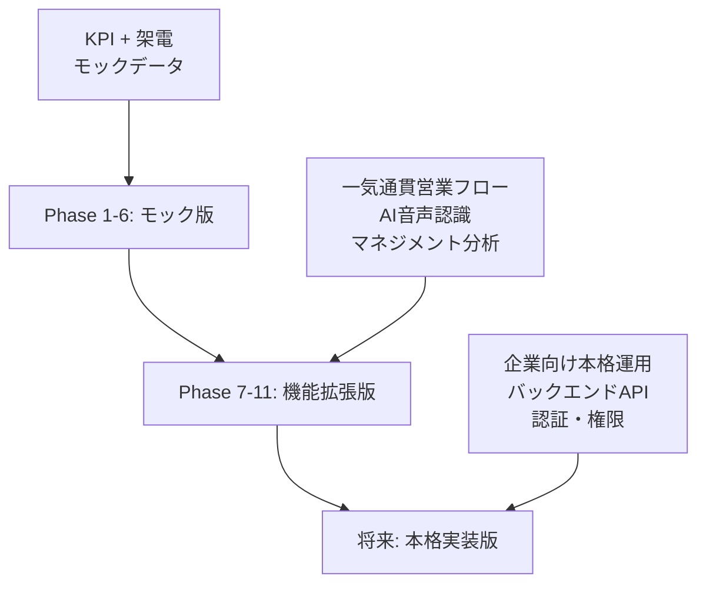

# プロジェクト構成ドキュメント v3.0

営業サポートAI プロジェクト（`018_sales_support_ai`）の実装済みディレクトリ構成と各ファイル・フォルダの役割について説明します。

**ドキュメント管理情報**
- 作成日：2025年1月24日
- 最終更新日：2025年1月24日
- バージョン：v3.0（実装状況反映版）
- 実装進捗：約85%完了

---

## 📑 目次

1. [プロジェクト全体構成](#1-プロジェクト全体構成)
2. [メインアプリケーション（sales-ai-mock）](#2-メインアプリケーションsales-ai-mock)
   - [2.1 ルートレベル](#21-ルートレベル)
   - [2.2 ソースコード（src）](#22-ソースコードsrc)
   - [2.3 コンポーネント詳細](#23-コンポーネント詳細)
   - [2.4 モックデータ構成](#24-モックデータ構成)
   - [2.5 ビルド成果物・除外設定](#25-ビルド成果物除外設定)
3. [ドキュメント構成（docs）](#3-ドキュメント構成docs)
4. [その他ディレクトリ](#4-その他ディレクトリ)
5. [設定ファイル解説](#5-設定ファイル解説)
6. [将来バックエンド構成（参考）](#6-将来バックエンド構成参考)
7. [開発環境セットアップ](#7-開発環境セットアップ)
8. [プロジェクト規模・フェーズ](#8-プロジェクト規模フェーズ)

---

## 1. プロジェクト全体構成（機能拡張版）

```
018_sales_support_ai/
├── 📂 sales-ai-mock/           # メインアプリケーション（機能拡張版）
├── 📂 docs/                    # プロジェクトドキュメント（機能拡張版対応）
│   ├── 📄 001_frontend_design_mock.md      # フロントエンド設計書 v2.0
│   ├── 📄 002_database_design.md           # データベース設計書 v2.0
│   ├── 📄 003_directory_structure.md       # 本ドキュメント v2.0
│   ├── 📄 004_requirements_mock.md         # 要件定義書 v2.0
│   ├── 📄 005_ui_design.md                 # 画面設計書 v2.0
│   └── 📄 006_demo_guide.md                # デモ・評価手順書 v2.0
├── 📂 images/                  # プロジェクト関連画像・スクリーンショット
├── 📂 _archive/                # アーカイブ資料（モック版等）
├── 📂 .claude/                 # Claude AI 設定
├── 📄 README.md                # プロジェクト概要（機能拡張版対応）
├── 📄 todo.md                  # 実装タスクリスト（機能拡張版）
├── 📄 next_order.md            # 次期実装計画
└── 📄 package-lock.json        # NPM依存関係（最小限）
```

---

## 2. メインアプリケーション（sales-ai-mock）

Vite + React + TypeScript で構築された営業サポートAIのフロントエンドモックアップ

### 2.1 ルートレベル
```
sales-ai-mock/
├── 📂 src/                     # ソースコード（詳細は2.2で説明）
├── 📂 public/                  # 静的アセット
├── 📂 dist/                    # ビルド出力（.gitignore対象）
├── 📂 node_modules/            # NPM依存関係（.gitignore対象）
├── 📄 package.json             # NPMパッケージ設定
├── 📄 package-lock.json        # 依存関係ロック
├── 📄 vite.config.ts           # Vite設定
├── 📄 tsconfig.json            # TypeScript基本設定
├── 📄 tsconfig.app.json        # アプリ用TypeScript設定
├── 📄 tsconfig.node.json       # Node.js用TypeScript設定
├── 📄 eslint.config.js         # ESLint設定
├── 📄 index.html               # HTMLエントリーポイント
├── 📄 README.md                # アプリケーション説明
└── 📄 .gitignore               # Git除外設定
```

### 2.2 ソースコード（src）- 実装済み構造
```
src/
├── 📂 components/              # Reactコンポーネント（実装済み）
│   ├── 📂 call/                # 架電関連（10ファイル実装済み）
│   │   ├── CallList.tsx
│   │   ├── CallResultForm.tsx
│   │   ├── CustomerDetailModal.tsx
│   │   ├── ActivityHistory.tsx
│   │   ├── CallRecording.tsx
│   │   ├── CallMemo.tsx
│   │   └── その他6ファイル
│   ├── 📂 kpi/                 # KPI関連（3ファイル実装済み）
│   │   ├── KPIOverview.tsx
│   │   ├── TodoList.tsx
│   │   └── NextAction.tsx
│   ├── 📂 layout/              # レイアウト関連（2ファイル実装済み）
│   │   ├── AppLayout.tsx
│   │   └── Navigation.tsx
│   ├── 📂 management/          # マネジメント関連（3ファイル実装済み）
│   │   ├── KPIGrid.tsx
│   │   ├── AnalysisFilter.tsx
│   │   └── CrossAnalysisGrid.tsx
│   └── 📂 visit/               # 訪問関連（2ファイル実装済み）
│       ├── VisitList.tsx
│       └── VisitResultForm.tsx
├── 📂 features/                # 機能別コンポーネント
│   ├── 📂 kpi/
│   └── 📂 management/
├── 📂 shared/                  # 共通コンポーネント
├── 📂 pages/                   # ページコンポーネント（4ファイル実装済み）
│   ├── KPIDashboard.tsx
│   ├── CallSupport.tsx
│   ├── VisitSupport.tsx
│   └── ManagementDashboard.tsx
├── 📂 data/                    # モックデータ（5ファイル実装済み）
│   ├── kpiData.json
│   ├── callListData.json
│   ├── activityHistory.json
│   ├── visitData.json
│   └── managementData.json
├── 📂 types/                   # TypeScript型定義（4ファイル実装済み）
│   ├── index.ts
│   ├── call.ts
│   ├── visit.ts
│   └── analytics.ts
├── 📂 utils/                   # ユーティリティ関数
├── 📂 assets/                  # アプリ内アセット
├── 📄 App.tsx                  # メインAppコンポーネント（ルーティング実装済み）
├── 📄 App.css                  # App用CSS
├── 📄 main.tsx                 # Reactエントリーポイント
├── 📄 index.css                # グローバルCSS
└── 📄 vite-env.d.ts            # Vite環境型定義
```

### 2.3 コンポーネント詳細

#### 📂 call/ - 架電関連コンポーネント（最優先実装）
```
call/
├── 📄 CallList.tsx                  # 架電リスト表示
├── 📄 CallButton.tsx                # 架電実行ボタン
├── 📄 CallResultForm.tsx            # 架電結果入力フォーム（固定項目）
├── 📄 ActivityHistory.tsx           # 活動履歴表示
├── 📄 CustomerDetailModal.tsx       # 顧客詳細ポップアップ
└── 📄 ReferenceInfo.tsx             # 顧客参考情報表示
```

#### 📂 management/ - マネジメントダッシュボード（新規）
```
management/
├── 📄 KPIGrid.tsx              # KPI一覧テーブル表示
├── 📄 AnalysisFilter.tsx       # 分析軸フィルター
├── 📄 KPITrendChart.tsx        # KPIトレンドグラフ
├── 📄 ConversionFunnel.tsx     # 営業ファネル表示
├── 📄 PerformanceComparison.tsx # パフォーマンス比較
└── 📄 ReportExport.tsx         # レポート出力機能
```

#### 📂 visit/ - 訪問管理（最優先実装）
```
visit/
├── 📄 VisitList.tsx                 # 訪問対象リスト
├── 📄 VisitResultForm.tsx           # 訪問結果入力フォーム
├── 📄 NegotiationTriggerModal.tsx   # 商談発生設定ポップアップ
└── 📄 VisitSchedule.tsx             # 訪問スケジュール管理
```

#### 📂 negotiation/ - 商談管理（最優先実装）
```
negotiation/
├── 📄 NegotiationList.tsx           # 商談リスト表示
├── 📄 NegotiationDetailModal.tsx    # 商談詳細ポップアップ
├── 📄 EstimateForm.tsx              # 見積管理フォーム
├── 📄 ProbabilitySlider.tsx         # 受注確度設定
├── 📄 BANTCForm.tsx                 # BANTC情報入力（AIたたき台）
└── 📄 NegotiationHistory.tsx        # 商談履歴表示
```

#### 📂 order/ - 受注管理（新規）
```
order/
├── 📄 OrderList.tsx            # 受注実績一覧
├── 📄 OrderStatistics.tsx      # 受注統計・集計
├── 📄 ProductAnalysis.tsx      # 商材別分析
├── 📄 MonthlyReport.tsx        # 月別実績レポート
└── 📄 OrderDetail.tsx          # 受注詳細表示
```

#### 📂 voice/ - AI音声認識（新規）
```
voice/
├── 📄 VoiceRecorder.tsx        # 音声録音コントロール
├── 📄 TranscriptDisplay.tsx    # 音声認識結果表示
├── 📄 AIJudgment.tsx           # AI判定結果表示
├── 📄 JudgmentCorrection.tsx   # AI判定修正フォーム
└── 📄 ConfidenceIndicator.tsx  # 認識精度表示
```

#### 📂 common/ - 共通コンポーネント（新規）
```
common/
├── 📄 PriorityTag.tsx          # 優先度タグ
├── 📄 StatusBadge.tsx          # ステータスバッジ
├── 📄 LoadingState.tsx         # ローディング状態
├── 📄 ErrorBoundary.tsx        # エラーハンドリング
├── 📄 EmptyState.tsx           # 空状態表示
└── 📄 ConfirmDialog.tsx        # 確認ダイアログ
```

#### 📂 layout/ - レイアウト関連コンポーネント
```
layout/
├── 📄 AppLayout.tsx            # アプリ全体レイアウト
├── 📄 Navigation.tsx           # ナビゲーションメニュー（拡張版対応）
├── 📄 Header.tsx               # ヘッダーコンポーネント
├── 📄 Sidebar.tsx              # サイドバーメニュー
└── 📄 BreadcrumbNav.tsx        # パンくずナビゲーション
```

#### 📂 kpi/ - KPI関連コンポーネント
```
kpi/
├── 📄 KPIOverview.tsx          # KPI概要ダッシュボード
├── 📄 KPIChart.tsx             # KPIグラフ表示
├── 📄 NextAction.tsx           # 次のアクション提示
├── 📄 TodoList.tsx             # TODOリスト管理
└── 📄 ProgressBar.tsx          # 進捗バー
```

### 2.4 機能拡張版モックデータ構成

```
data/
├── 📄 kpiData.json             # KPI・売上目標データ
├── 📄 callListData.json        # 架電先リストデータ
├── 📄 customerData.json        # 顧客詳細データ
├── 📄 todoData.json            # TODOリストデータ
├── 📄 activityHistory.json     # 活動履歴データ（最優先実装）
├── 📄 bantcData.json           # BANTC情報データ（最優先実装）
├── 📄 visitData.json           # 訪問予定・実績データ（最優先実装）
├── 📄 negotiationData.json     # 商談情報データ（最優先実装）
├── 📄 managementData.json      # マネジメント分析データ
├── 📄 orderData.json           # 受注実績データ
├── 📄 userData.json            # ユーザー・権限データ
└── 📄 masterData.json          # マスタデータ（拡張版）
```

#### 機能拡張版データファイル詳細
| ファイル名 | 内容 | サイズ目安 | 更新頻度 |
|------------|------|-----------|----------|
| `kpiData.json` | KGI売上目標、10項目KPI目標値と実績 | ~8KB | デモ準備時 |
| `callListData.json` | 架電先企業リスト、優先度、AI判定結果 | ~20KB | デモ準備時 |
| `managementData.json` | 部署別・担当者別KPI実績、時系列データ | ~50KB | デモ準備時 |
| `visitData.json` | 訪問予定・実績、商談発生フラグ | ~25KB | デモ準備時 |
| `negotiationData.json` | 商談詳細、見積情報、確度・金額 | ~35KB | デモ準備時 |
| `orderData.json` | 受注実績、商材別集計、月別データ | ~30KB | デモ準備時 |
| `voiceData.json` | 音声認識サンプル、AI判定結果 | ~15KB | デモ準備時 |
| `userData.json` | ユーザー情報、権限、部署データ | ~5KB | 初期設定時 |
| `masterData.json` | 拡張マスタ（ステータス、商材、業界等） | ~8KB | 初期設定時 |

#### サンプルデータ設計原則
- **リアリティ**: 実際の営業活動に近いサンプルデータ
- **多様性**: 業界・規模・進捗状況のバリエーション
- **ストーリー性**: 架電→アポ→提案の流れが追跡可能
- **プライバシー**: 実在企業名・個人名は使用しない

### 2.5 ビルド成果物・除外設定

#### 📂 dist/ - ビルド出力
```
dist/                           # .gitignore対象
├── 📂 assets/                  # バンドルされたJS/CSS
│   ├── 📄 index-[hash].js      # メインJSバンドル
│   ├── 📄 index-[hash].css     # メインCSSバンドル
│   └── 📄 vendor-[hash].js     # ベンダーJSバンドル
├── 📄 index.html               # 本番用HTML
└── 📄 vite.svg                 # 静的アセット
```

#### .gitignore設定
```gitignore
# ビルド成果物
dist/
dist-ssr/

# 依存関係
node_modules/

# 環境設定
.env
.env.local
.env.*.local

# ログファイル
npm-debug.log*
yarn-debug.log*
yarn-error.log*

# エディタ設定
.vscode/
.idea/

# OS固有ファイル
.DS_Store
Thumbs.db
```

#### ビルド最適化設定
- **コード分割**: vendor, app, chunkに分割
- **Tree Shaking**: 未使用コードの除去
- **ミニファイ**: 本番ビルドでの圧縮
- **ハッシュ化**: キャッシュバスティング対応

---

## 3. ドキュメント構成（docs）

```
docs/
├── 📄 001_frontend_design_mock.md      # フロントエンド設計書（新規作成済み）
├── 📄 002_database_design.md           # データベース設計書（改善済み）
├── 📄 003_directory_structure.md       # 本ドキュメント
├── 📄 004_requirements_mock.md         # 要件定義書（作成予定）
├── 📄 005_ui_design.md                 # 画面設計書（作成予定）
├── 📄 006_demo_guide.md                # デモ手順書（作成予定）
├── 📄 007_implementation_roadmap.md    # 実装移行計画（作成予定）
└── 📄 document_todo.md                 # ドキュメント改善タスク
```

**ドキュメント改善状況:**
- ✅ **設計書系**: 001, 002 更新完了（目次、ER図、制約追加）
- ✅ **構成管理**: 003 更新完了（本ドキュメント）
- 🚧 **要件系**: 004 作成中
- 📋 **UI設計**: 005-007 作成予定

---

## 4. その他ディレクトリ

### 📂 images/ - プロジェクト関連画像
```
images/
├── 📄 kpi_dashboard_mockup.png         # KPIダッシュボードのモックアップ
├── 📄 call_support_wireframe.png       # 架電支援画面のワイヤーフレーム
└── 📄 0321_SalesMarker_image8-1024x684.jpg  # 営業関連参考画像
```

### 📂 _archive/ - アーカイブ資料
```
_archive/
├── 📄 requirements.md                  # 旧要件定義書（339行）
├── 📄 design_v0.md                     # 旧設計書（アーカイブ）
└── 📄 meeting_notes/                   # 会議議事録（予定）
```

### 📂 .claude/ - Claude AI設定
```
.claude/
└── 📄 settings.local.json              # Claude AI ローカル設定
```

---

## 5. 設定ファイル解説

### package.json の主要依存関係
```json
{
  "dependencies": {
    "@ant-design/icons": "^6.0.0",    // Ant Design アイコン
    "antd": "^5.26.6",                 // Ant Design UIライブラリ
    "chart.js": "^4.5.0",              // チャートライブラリ
    "react": "^19.1.0",                // React本体
    "react-chartjs-2": "^5.3.0",       // ReactでChart.js使用
    "react-dom": "^19.1.0",            // React DOM
    "react-router-dom": "^7.7.0"       // React Router
  },
  "devDependencies": {
    "@types/react": "^19.0.0",         // React型定義
    "@vitejs/plugin-react": "^4.3.4",  // Vite React プラグイン
    "eslint": "^9.17.0",               // ESLint
    "typescript": "^5.7.2",            // TypeScript
    "vite": "^7.0.0"                   // Vite ビルドツール
  }
}
```

### 開発コマンド
```bash
npm run dev     # 開発サーバー起動（http://localhost:5173）
npm run build   # 本番ビルド（dist/に出力）
npm run lint    # ESLintチェック
npm run preview # ビルド結果プレビュー
npm run type-check  # TypeScriptタイプチェック（追加予定）
```

### Vite設定（vite.config.ts）
```typescript
export default defineConfig({
  plugins: [react()],
  build: {
    rollupOptions: {
      output: {
        manualChunks: {
          vendor: ['react', 'react-dom'],
          antd: ['antd', '@ant-design/icons'],
          charts: ['chart.js', 'react-chartjs-2']
        }
      }
    }
  }
});
```

---

## 6. 将来バックエンド構成（参考）

### Phase 2: バックエンド実装予定構成
```
018_sales_support_ai/
├── 📂 sales-ai-mock/           # フロントエンド（現在）
├── 📂 sales-ai-backend/        # バックエンド（Phase 2予定）
│   ├── 📂 src/
│   │   ├── 📂 controllers/     # APIコントローラー
│   │   ├── 📂 models/          # データモデル
│   │   ├── 📂 routes/          # ルーティング
│   │   ├── 📂 middleware/      # ミドルウェア
│   │   ├── 📂 services/        # ビジネスロジック
│   │   └── 📂 utils/           # ユーティリティ
│   ├── 📂 database/
│   │   ├── 📂 migrations/      # DBマイグレーション
│   │   ├── 📂 seeds/           # 初期データ
│   │   └── 📄 schema.sql       # DB スキーマ
│   ├── 📄 package.json
│   ├── 📄 server.js            # サーバーエントリーポイント
│   └── 📄 .env.example         # 環境変数テンプレート
└── 📂 sales-ai-ai/             # AI機能（Phase 3予定）
    ├── 📂 models/              # AIモデル
    ├── 📂 training/            # 学習データ
    └── 📂 api/                 # AI API
```

### 技術スタック予定
| 分野 | 技術 | 理由 |
|------|------|------|
| **バックエンド** | Node.js + Express | フロントエンドとの言語統一 |
| **データベース** | PostgreSQL | リレーショナルデータの整合性 |
| **認証** | JWT + Passport.js | セキュアな認証 |
| **ORM** | Prisma | TypeScript対応 |
| **API仕様** | OpenAPI (Swagger) | API文書化 |
| **テスト** | Jest + Supertest | 自動テスト |
| **デプロイ** | Docker + Vercel | コンテナ化・簡単デプロイ |

---

## 7. 開発環境セットアップ

### 前提条件
- Node.js 18.0 以上
- npm 9.0 以上
- Git

### 機能拡張版セットアップ手順
1. **プロジェクトクローン/移動**
   ```bash
   cd 018_sales_support_ai/sales-ai-mock
   ```

2. **機能拡張版依存関係インストール**
   ```bash
   npm install
   npm install dayjs papaparse file-saver @types/file-saver
   npm install react-virtual @tanstack/react-virtual
   npm install recharts
   ```

3. **開発サーバー起動**
   ```bash
   npm run dev
   ```

4. **機能テスト実行（推奨）**
   ```bash
   npm run test
   ```

3. **開発サーバー起動**
   ```bash
   npm run dev
   ```

4. **ブラウザアクセス**
   ```
   http://localhost:5173
   ```

### 推奨開発ツール
- **IDE**: Visual Studio Code
- **拡張機能**: 
  - ES7+ React/Redux/React-Native snippets
  - TypeScript Importer
  - Prettier - Code formatter
  - ESLint
- **ブラウザ**: Chrome（React DevTools使用）

---

## 8. プロジェクト規模・フェーズ（機能拡張版）

### 完了済み（Phase 1-6: モック版）
- **総ファイル数**: 約35ファイル
- **TypeScriptファイル**: 約25ファイル
- **総コード行数**: 約4,000行（ドキュメント含む）
- **アプリケーションコード**: 約2,000行
- **実装時間**: 10分

### 機能拡張版（Phase 7-11）
- **総ファイル数**: 約80ファイル（推定）
- **新規コンポーネント**: 約40ファイル
- **総コード行数**: 約12,000行（推定）
- **アプリケーションコード**: 約8,000行
- **モックデータ**: 約200KB（JSON）
- **実装時間**: 38時間（1ヶ月以内）

### 各フェーズの構成変化

#### Phase 1-6: モック版 ✅ 完了
- **フロントエンドのみ**: React SPA
- **機能**: KPI指示だし + 架電支援
- **ファイル数**: ~35ファイル

#### Phase 7-11: 機能拡張版 🚧 実装中
- **フロントエンド拡張**: 一気通貫営業フロー
- **機能**: マネジメント + 訪問 + 商談 + 受注 + AI音声認識
- **ファイル数**: ~80ファイル

#### 将来: 本格実装版 📋 予定
- **フルスタック**: React + Node.js + AI API
- **機能**: 企業向け本格運用
- **ファイル数**: ~150ファイル

### 機能拡張版アーキテクチャ予測


---

**プロジェクト構成管理情報**
- 作成日：2025年1月24日
- 最終更新日：2025年1月24日
- バージョン：v2.0（機能拡張版）
- 対象：機能拡張版ディレクトリ構成
- 実装期限：1ヶ月以内
- 次回見直し予定：機能拡張版完了時

**更新履歴**
| 日付 | バージョン | 更新内容 | 更新者 |
|------|------------|----------|--------|
| 2025/01/24 | v1.0 | 初版作成（モック版） | システム設計チーム |
| 2025/01/24 | v2.0 | 機能拡張版対応（新規機能ディレクトリ・データ構造追加） | システム設計チーム |

---

**構成管理情報**
- 作成日：2025年1月24日
- 最終更新日：2025年1月24日
- バージョン：v1.0
- 対象：現在のプロジェクト構成とモック版
- 次回見直し予定：バックエンド実装開始時（Phase 2移行時）
- 管理担当：プロジェクト管理チーム 