# 営業サポートAI 画面設計書 v3.0

**ドキュメント管理情報**
- 作成日：2025年1月24日
- 最終更新日：2025年1月24日
- バージョン：v3.0（実装状況反映版）
- 実装進捗：約85%完了（4画面実装済み）
- 残り実装：商談・受注専用画面

---

## 📑 目次

1. [設計概要](#1-設計概要)
2. [画面構成・サイトマップ](#2-画面構成サイトマップ)
3. [共通UI仕様](#3-共通ui仕様)
4. [KPI指示だし画面設計](#4-kpi指示だし画面設計)
5. [架電支援画面設計（最優先）](#5-架電支援画面設計最優先)
6. [訪問管理画面設計（最優先）](#6-訪問管理画面設計最優先)
7. [商談管理画面設計（最優先）](#7-商談管理画面設計最優先)
8. [ポップアップ・モーダル設計（最優先）](#8-ポップアップモーダル設計最優先)
9. [マネジメントダッシュボード設計](#9-マネジメントダッシュボード設計)
10. [受注履歴画面設計](#10-受注履歴画面設計)
11. [レスポンシブ対応](#11-レスポンシブ対応)
12. [状態別表示パターン](#12-状態別表示パターン)
13. [コンポーネント仕様](#13-コンポーネント仕様)
14. [実装ガイドライン](#14-実装ガイドライン)

---

## 1. 設計概要

### 1.1 UI設計思想
- **直感的操作**: 営業担当者が迷わず操作できるシンプルなUI
- **情報の見える化**: KPI達成状況を一目で把握できるダッシュボード
- **行動促進**: 次に何をすべきかが明確にわかるアクション指向設計
- **効率化重視**: 入力・操作時間を極限まで削減する設計

### 1.2 デザインシステム基盤
- **UI Framework**: Ant Design 5.x
- **カラーパレット**: ブルー系プライマリカラー (#1890ff)
- **レイアウト**: グリッドベースの構造化レイアウト
- **アイコン**: Ant Design Icons統一使用

---

## 2. 画面構成・サイトマップ

### 2.1 実装済み画面遷移図
```mermaid
graph TB
    A[メインレイアウト] --> B[KPI指示だし画面<br/>Dashboard ✅]
    A --> C[架電支援画面<br/>Call Support ✅]
    A --> D[マネジメントダッシュボード<br/>Management ✅]
    A --> E[訪問管理画面<br/>Visit Support ✅]
    A --> F[商談管理画面<br/>Negotiation Support 🔄]
    A --> G[受注履歴画面<br/>Order History 🔄]
    
    B --> B1[KPI詳細モーダル]
    B --> B2[ToDo詳細パネル]
    B --> B3[進捗レポート]
    
    C --> C1[架電リスト表示]
    C --> C2[架電結果入力フォーム]
    C --> C3[顧客詳細ポップアップ]
    C --> C4[活動履歴表示]
    
    D --> D1[KPI一覧表示]
    D --> D2[分析軸フィルター]
    D --> D3[チャート・グラフ表示]
    D --> D4[レポート出力]
    
    E --> E1[訪問予定リスト]
    E --> E2[訪問結果入力フォーム]
    E --> E3[商談発生設定ポップアップ]
    
    F --> F1[商談リスト表示]
    F --> F2[商談詳細ポップアップ]
    F --> F3[見積・確度管理]
    F --> F4[BANTC情報編集]
    
    G --> G1[受注実績一覧]
    G --> G2[月別集計表示]
    G --> G3[商材別分析]
    
    style A fill:#e1f5fe
    style B fill:#f3e5f5
    style C fill:#e8f5e8
    style D fill:#fff3e0
    style E fill:#e8f5e8
    style F fill:#f1f8e9
    style G fill:#fce4ec
```

### 2.2 画面階層構造
```
AppLayout (共通レイアウト)
├── Header (ヘッダー・ナビゲーション)
├── Sidebar (サイドメニュー) 
└── Content (メインコンテンツエリア)
    ├── KPIDashboard (KPI指示だし画面)
    │   ├── KPICards (KPI表示カード群)
    │   ├── TodoList (行動指示リスト)
    │   └── ProgressChart (進捗可視化)
    └── CallSupport (架電支援画面)
        ├── CallList (架電対象リスト)
        ├── CustomerPanel (顧客情報パネル)
        └── CallForm (架電結果入力)
```

---

## 3. 共通UI仕様

### 3.1 ヘッダー・ナビゲーション設計

#### 3.1.1 ヘッダー構成
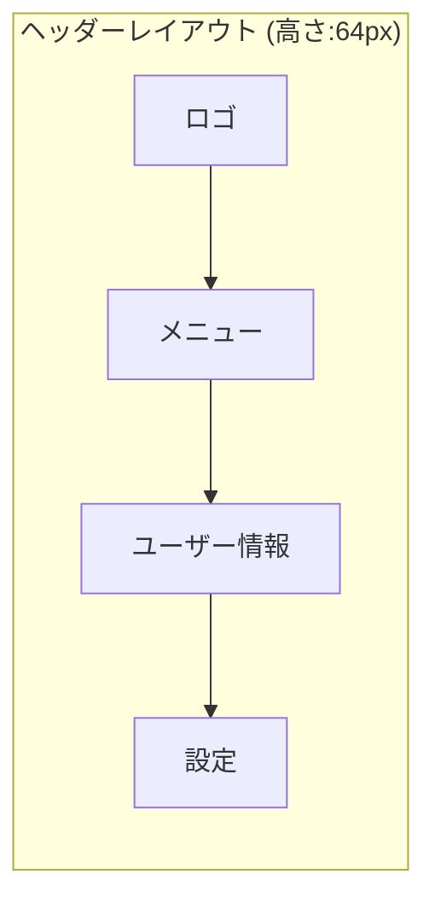

#### 3.1.2 ヘッダー仕様詳細
| 要素 | 位置 | サイズ | 機能 |
|------|------|------|------|
| ロゴ | 左端 | 120px×32px | トップページ遷移 |
| タイトル | ロゴ隣 | 自動幅 | 「営業サポートAI」 |
| メニュー | 中央 | 自動幅 | ナビゲーション |
| ユーザー名 | 右端 | 自動幅 | 「田中 真一」表示 |
| アバター | 最右端 | 32px×32px | ユーザーアイコン |

#### 3.1.3 サイドメニュー設計
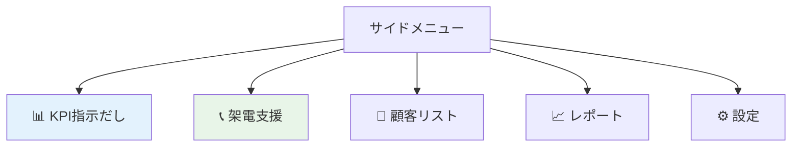

### 3.2 色彩・フォント定義

#### 3.2.1 カラーパレット
```css
/* プライマリカラー */
--primary-color: #1890ff;      /* メインブランドカラー */
--primary-light: #40a9ff;      /* ホバー状態 */
--primary-dark: #096dd9;       /* アクティブ状態 */

/* セマンティックカラー */
--success-color: #52c41a;      /* 目標達成・成功 */
--warning-color: #faad14;      /* 注意・未達成 */
--error-color: #ff4d4f;        /* エラー・緊急 */
--info-color: #1890ff;         /* 情報・ニュートラル */

/* グレースケール */
--text-primary: #262626;       /* メインテキスト */
--text-secondary: #8c8c8c;     /* サブテキスト */
--background-light: #fafafa;   /* 背景色 */
--border-color: #d9d9d9;       /* ボーダー */
```

#### 3.2.2 フォント仕様
```css
/* フォントファミリー */
font-family: -apple-system, BlinkMacSystemFont, 'Segoe UI', Roboto, 'Helvetica Neue', Arial, sans-serif;

/* フォントサイズ階層 */
--font-size-xs: 12px;     /* 補助情報 */
--font-size-sm: 14px;     /* 通常テキスト */
--font-size-base: 16px;   /* 基本サイズ */
--font-size-lg: 18px;     /* 強調テキスト */
--font-size-xl: 20px;     /* 見出し */
--font-size-xxl: 24px;    /* 大見出し */
```

### 3.3 アイコン利用方針

#### 3.3.1 機能別アイコン定義
| 機能カテゴリ | アイコン | 用途 |
|--------------|----------|------|
| KPI・目標 | 📊 TrophyOutlined | KPI指示だし |
| 架電・通話 | 📞 PhoneOutlined | 架電関連機能 |
| 顧客・企業 | 👥 UserOutlined | 顧客情報 |
| レポート | 📈 BarChartOutlined | 分析・報告 |
| 設定 | ⚙️ SettingOutlined | システム設定 |
| 成功・達成 | ✅ CheckCircleOutlined | 目標達成 |
| 警告・注意 | ⚠️ ExclamationCircleOutlined | 未達成・注意 |

---

## 4. KPI指示だし画面設計

### 4.1 画面レイアウト構成

#### 4.1.1 レイアウト構造
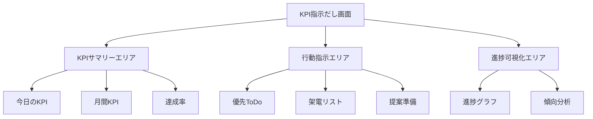

#### 4.1.2 グリッドレイアウト（24列グリッド）
```css
/* 画面全体レイアウト */
.kpi-dashboard {
  display: grid;
  grid-template-columns: repeat(24, 1fr);
  gap: 16px;
  padding: 24px;
}

/* KPIサマリーエリア */
.kpi-summary {
  grid-column: 1 / 25;
  grid-row: 1;
}

/* 行動指示エリア */
.action-area {
  grid-column: 1 / 17;  /* 16列幅 */
  grid-row: 2;
}

/* 進捗可視化エリア */
.progress-area {
  grid-column: 17 / 25;  /* 8列幅 */
  grid-row: 2;
}
```

### 4.2 KPIサマリーカード設計

#### 4.2.1 KPIカード構成
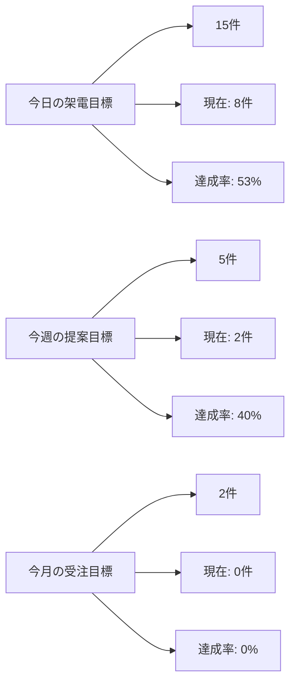

#### 4.2.2 状態別表示パターン
| 達成率 | 背景色 | ボーダー | アイコン | テキスト色 |
|--------|--------|----------|----------|------------|
| 80%以上 | #f6ffed | #52c41a | ✅ CheckCircleOutlined | #52c41a |
| 50-79% | #fff7e6 | #faad14 | ⚠️ ExclamationCircleOutlined | #faad14 |
| 50%未満 | #fff2f0 | #ff4d4f | ❌ CloseCircleOutlined | #ff4d4f |

### 4.3 行動指示エリア設計

#### 4.3.1 優先ToDoリスト
```jsx
// ToDoアイテム表示例
<List.Item
  actions={[
    <Button type="primary" size="small">実行</Button>,
    <Button size="small">詳細</Button>
  ]}
>
  <List.Item.Meta
    avatar={<Avatar icon={<PhoneOutlined />} />}
    title="株式会社ABC 田中様に架電"
    description="前回ヒアリング結果のフォローアップ | 優先度: 高"
  />
</List.Item>
```

#### 4.3.2 行動指示優先度表示
| 優先度 | 色 | アイコン | 表示順序 |
|--------|-----|----------|----------|
| 緊急 | #ff4d4f | 🔥 FireOutlined | 1 |
| 高 | #faad14 | ⚡ ThunderboltOutlined | 2 |
| 中 | #1890ff | 📋 FileTextOutlined | 3 |
| 低 | #8c8c8c | 📝 EditOutlined | 4 |

---

## 5. 架電支援画面設計（最優先）

### 5.1 画面レイアウト構成

#### 5.1.1 メイン画面+ポップアップ構成
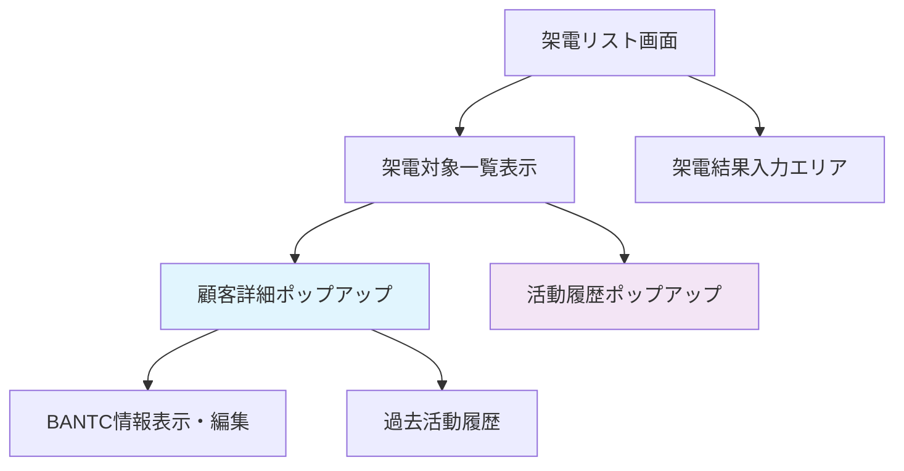

#### 5.1.2 レイアウト詳細仕様
```css
.call-support-layout {
  display: grid;
  grid-template-columns: 2fr 1fr;
  height: calc(100vh - 64px);
  gap: 16px;
  padding: 16px;
}

.call-list-area {
  background: #ffffff;
  border-radius: 8px;
  padding: 16px;
  border: 1px solid #d9d9d9;
}

.call-result-area {
  background: #ffffff;
  border-radius: 8px;
  padding: 16px;
  border: 1px solid #d9d9d9;
}

/* ポップアップ・モーダルスタイル */
.customer-detail-modal {
  .ant-modal-content {
    width: 800px;
    max-height: 600px;
  }
}
```

### 5.2 架電結果項目設計（固定選択）

#### 5.2.1 架電結果選択項目
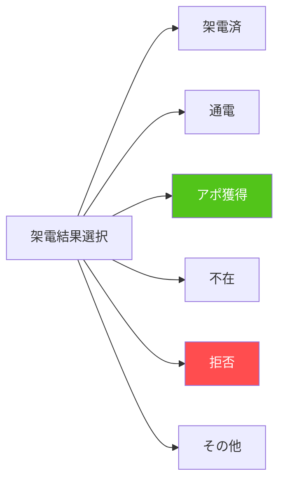

#### 5.2.2 架電結果フォーム設計
```jsx
// 架電結果入力フォーム
<Form layout="vertical">
  <Form.Item 
    label="架電結果" 
    name="callResult" 
    rules={[{ required: true, message: '架電結果を選択してください' }]}
  >
    <Radio.Group>
      <Radio value="called">架電済</Radio>
      <Radio value="connected">通電</Radio>
      <Radio value="appointment">アポ獲得</Radio>
      <Radio value="absent">不在</Radio>
      <Radio value="refused">拒否</Radio>
      <Radio value="other">その他</Radio>
    </Radio.Group>
  </Form.Item>
  
  <Form.Item label="詳細メモ（任意）" name="notes">
    <TextArea 
      rows={4} 
      placeholder="架電内容の詳細を記入してください..."
      maxLength={500}
    />
  </Form.Item>
  
  <Form.Item>
    <Space>
      <Button type="primary" htmlType="submit">保存</Button>
      <Button>キャンセル</Button>
    </Space>
  </Form.Item>
</Form>
```

#### 5.2.3 架電結果項目の表示スタイル
| 結果項目 | 色 | アイコン | 次アクション |
|----------|-----|----------|--------------|
| 架電済 | #8c8c8c | 📞 PhoneOutlined | - |
| 通電 | #1890ff | ✅ CheckOutlined | 詳細入力促進 |
| アポ獲得 | #52c41a | 🎯 StarOutlined | 訪問リスト自動追加 |
| 不在 | #faad14 | 📵 PhoneOffOutlined | 再架電設定 |
| 拒否 | #ff4d4f | ❌ CloseOutlined | ステータス更新 |
| その他 | #722ed1 | 📝 EditOutlined | 詳細入力必須 |

### 5.2 架電リスト設計

#### 5.2.1 リストアイテム表示
```jsx
// 架電リストアイテム例
<List.Item
  className={selectedItem ? 'selected' : ''}
  onClick={() => selectCustomer(customer)}
>
  <List.Item.Meta
    avatar={
      <Badge count={urgencyLevel} offset={[-5, 5]}>
        <Avatar>{customer.name[0]}</Avatar>
      </Badge>
    }
    title={
      <Space>
        <Text strong>{customer.company}</Text>
        <Tag color={getPriorityColor(customer.priority)}>
          {customer.priority}
        </Tag>
      </Space>
    }
    description={
      <div>
        <div>{customer.name} {customer.position}</div>
        <div>前回: {customer.lastContact} | 目的: {customer.purpose}</div>
      </div>
    }
  />
</List.Item>
```

#### 5.2.2 フィルタリング・ソート機能
| フィルタ項目 | オプション | デフォルト |
|--------------|------------|------------|
| 優先度 | 全て/緊急/高/中/低 | 全て |
| ステータス | 全て/新規/フォロー/再架電 | 全て |
| 業界 | 全て/IT/製造業/サービス業... | 全て |
| ソート | 優先度/最終架電日/会社名 | 優先度 |

### 5.3 顧客詳細パネル設計

#### 5.3.1 情報表示セクション
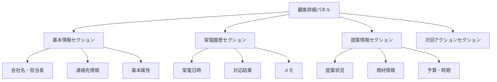

#### 5.3.2 架電履歴表示
```jsx
<Timeline>
  <Timeline.Item color="green">
    <div>
      <Text strong>2025/01/20 14:30</Text>
      <Tag color="success">接続</Tag>
    </div>
    <div>ヒアリング実施。予算確保済み、4月導入希望</div>
  </Timeline.Item>
  <Timeline.Item color="blue">
    <div>
      <Text strong>2025/01/15 10:15</Text>
      <Tag color="processing">不在</Tag>
    </div>
    <div>担当者不在。秘書より「来週再架電希望」</div>
  </Timeline.Item>
</Timeline>
```

### 5.4 架電結果入力フォーム

#### 5.4.1 入力フィールド構成
| フィールド | 入力形式 | 必須 | 説明 |
|------------|----------|------|------|
| 架電結果 | ラジオボタン | ✅ | 接続/不在/拒否/その他 |
| 対応者 | セレクト | - | 担当者/代理者/受付 |
| 通話時間 | 数値入力 | - | 分単位 |
| ヒアリング内容 | テキストエリア | - | 商談内容・要件 |
| 次回アクション | セレクト | ✅ | 再架電/提案書/訪問/クロージング |
| 次回予定日 | 日付ピッカー | - | フォローアップ予定 |

#### 5.4.2 操作フロー設計
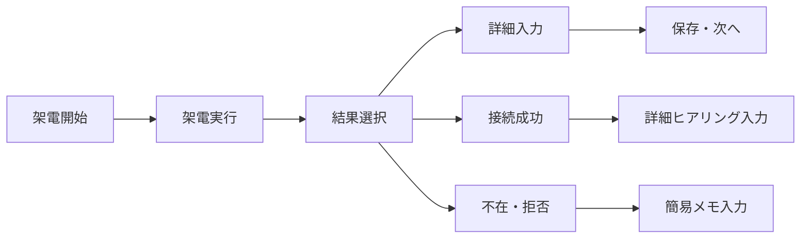

---

## 6. 訪問管理画面設計（最優先）

### 6.1 画面レイアウト構成

#### 6.1.1 メイン画面+ポップアップ構成
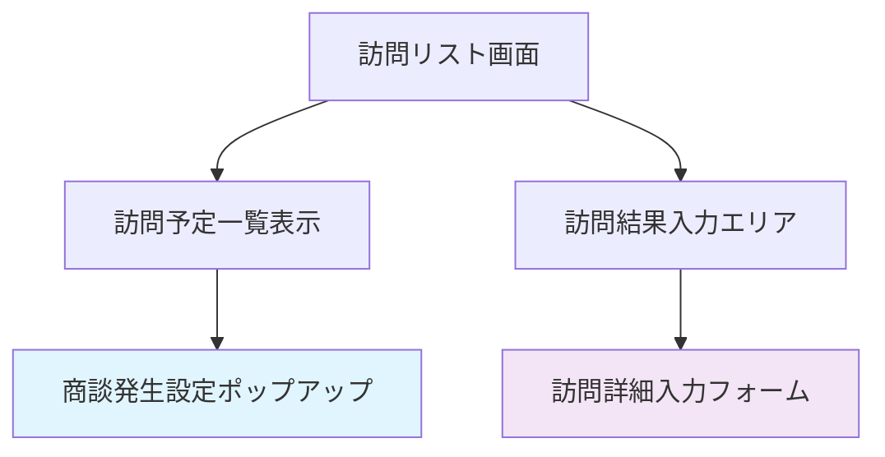

#### 6.1.2 訪問リスト表示
```jsx
<List
  dataSource={visitList}
  renderItem={(visit) => (
    <List.Item
      actions={[
        <Button type="primary" size="small">
          訪問結果入力
        </Button>,
        <Button size="small" onClick={() => showNegotiationModal(visit)}>
          商談設定
        </Button>
      ]}
    >
      <List.Item.Meta
        avatar={<Avatar icon={<UserOutlined />} />}
        title={`${visit.company} ${visit.contact}`}
        description={`訪問予定: ${visit.visitDate} | 目的: ${visit.purpose}`}
      />
      <div>
        <Tag color={visit.status === 'scheduled' ? 'blue' : 'green'}>
          {visit.status === 'scheduled' ? '予定' : '完了'}
        </Tag>
      </div>
    </List.Item>
  )}
/>
```

### 6.2 訪問結果入力フォーム
```jsx
<Form layout="vertical">
  <Form.Item 
    label="訪問結果" 
    name="visitResult" 
    rules={[{ required: true }]}
  >
    <Radio.Group>
      <Radio value="success">成功</Radio>
      <Radio value="partial">一部成功</Radio>
      <Radio value="failed">失敗</Radio>
      <Radio value="reschedule">再訪問必要</Radio>
    </Radio.Group>
  </Form.Item>
  
  <Form.Item label="商談発生" name="negotiationFlag">
    <Switch 
      checkedChildren="商談あり" 
      unCheckedChildren="商談なし" 
    />
  </Form.Item>
  
  <Form.Item label="訪問内容" name="content">
    <TextArea rows={6} placeholder="訪問内容を記入してください..." />
  </Form.Item>
</Form>
```

---

## 7. 商談管理画面設計（最優先）

### 7.1 画面レイアウト構成

#### 7.1.1 リスト+詳細ポップアップ構成
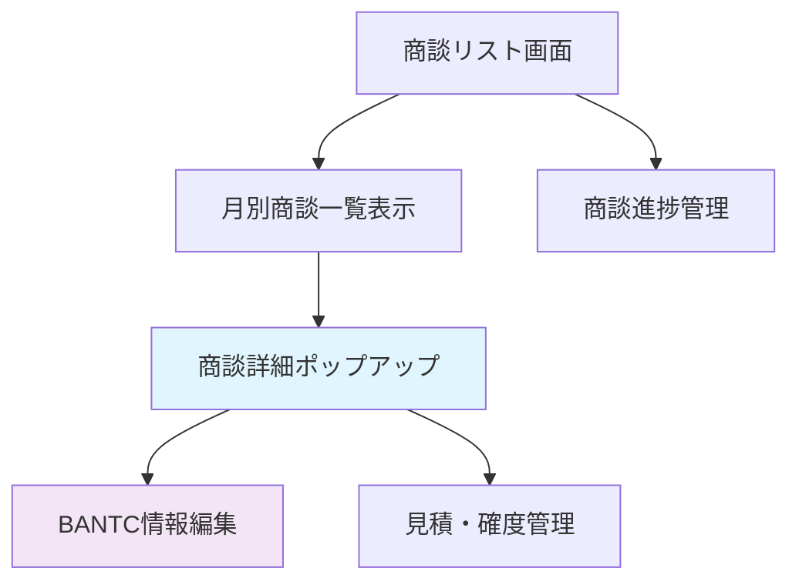

### 7.2 商談リスト表示
```jsx
<Table
  columns={[
    {
      title: '顧客',
      dataIndex: 'customer',
      key: 'customer',
    },
    {
      title: '商談金額',
      dataIndex: 'amount',
      key: 'amount',
      render: (amount) => `¥${amount.toLocaleString()}`,
    },
    {
      title: '受注確度',
      dataIndex: 'probability',
      key: 'probability',
      render: (prob) => <Progress percent={prob} size="small" />,
    },
    {
      title: '商談段階',
      dataIndex: 'stage',
      key: 'stage',
      render: (stage) => <Tag color="blue">{stage}</Tag>,
    },
    {
      title: '操作',
      key: 'action',
      render: (_, record) => (
        <Space>
          <Button size="small" onClick={() => showDetailModal(record)}>
            詳細
          </Button>
          <Button size="small" type="primary">
            見積更新
          </Button>
        </Space>
      ),
    },
  ]}
  dataSource={negotiationList}
  pagination={{ pageSize: 20 }}
/>
```

---

## 8. ポップアップ・モーダル設計（最優先）

### 8.1 顧客詳細ポップアップ

#### 8.1.1 モーダル構成
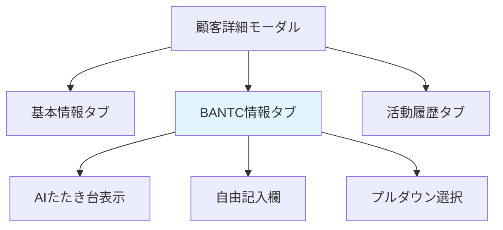

#### 8.1.2 BANTC情報入力フォーム（AIたたき台+自由記入）
```jsx
<Card title="BANTC情報" extra={<Tag color="blue">AI分析結果</Tag>}>
  <Form layout="vertical">
    <Form.Item label="Budget（予算）">
      <Row gutter={8}>
        <Col span={12}>
          <Select 
            placeholder="予算範囲" 
            options={[
              { value: '100-500', label: '100-500万円' },
              { value: '500-1000', label: '500-1000万円' },
              { value: '1000+', label: '1000万円以上' }
            ]}
          />
        </Col>
        <Col span={12}>
          <Input placeholder="詳細情報" />
        </Col>
      </Row>
      <div style={{ marginTop: 8, padding: 8, background: '#f6ffed', borderRadius: 4 }}>
        <Text type="secondary">
          <RobotOutlined /> AI分析: 前回の商談内容から、500-1000万円程度の予算を想定
        </Text>
      </div>
    </Form.Item>
    
    <Form.Item label="Authority（決裁権）">
      <Row gutter={8}>
        <Col span={12}>
          <Select 
            placeholder="決裁者階層" 
            options={[
              { value: 'manager', label: '部長クラス' },
              { value: 'director', label: '取締役クラス' },
              { value: 'president', label: '社長クラス' }
            ]}
          />
        </Col>
        <Col span={12}>
          <Input placeholder="決裁者名・役職" />
        </Col>
      </Row>
      <div style={{ marginTop: 8, padding: 8, background: '#f6ffed', borderRadius: 4 }}>
        <Text type="secondary">
          <RobotOutlined /> AI分析: IT部長が主担当、最終決裁は常務取締役の可能性
        </Text>
      </div>
    </Form.Item>
    
    <Form.Item label="Need（課題・ニーズ）">
      <TextArea 
        rows={4} 
        placeholder="顧客の課題やニーズを記入してください..."
      />
      <div style={{ marginTop: 8, padding: 8, background: '#f6ffed', borderRadius: 4 }}>
        <Text type="secondary">
          <RobotOutlined /> AI分析: 現行システムの老朽化、運用コスト削減が主な課題
        </Text>
      </div>
    </Form.Item>
    
    <Form.Item label="Timeline（導入時期）">
      <Row gutter={8}>
        <Col span={12}>
          <Select 
            placeholder="導入希望時期" 
            options={[
              { value: '3months', label: '3ヶ月以内' },
              { value: '6months', label: '6ヶ月以内' },
              { value: '1year', label: '1年以内' }
            ]}
          />
        </Col>
        <Col span={12}>
          <DatePicker placeholder="具体的な希望日" />
        </Col>
      </Row>
    </Form.Item>
    
    <Form.Item label="Competition（競合情報）">
      <TextArea 
        rows={3} 
        placeholder="競合他社の情報を記入してください..."
      />
    </Form.Item>
  </Form>
</Card>
```

### 8.2 活動履歴ポップアップ

#### 8.2.1 時系列表示（next_order.md 51-54行目準拠）
```jsx
<Timeline mode="left">
  <Timeline.Item 
    color="green" 
    label="2025/01/20 14:30"
    dot={<PhoneOutlined />}
  >
    <Card size="small" title="架電">
      <Row gutter={8}>
        <Col span={12}>
          <Select 
            value="appointment"
            disabled
            style={{ width: '100%' }}
            options={[
              { value: 'called', label: '架電済' },
              { value: 'connected', label: '通電' },
              { value: 'appointment', label: 'アポ獲得' },
              { value: 'absent', label: '不在' },
              { value: 'refused', label: '拒否' },
              { value: 'other', label: 'その他' }
            ]}
          />
        </Col>
        <Col span={12}>
          <Text type="secondary">架電結果</Text>
        </Col>
      </Row>
      <div style={{ marginTop: 8 }}>
        <TextArea 
          value="システム更新についてヒアリング実施。次回訪問: 2025/01/25 10:00予定"
          disabled
          rows={2}
          style={{ background: '#fafafa' }}
        />
      </div>
      <div style={{ marginTop: 8 }}>
        <Tag color="green">アポ獲得</Tag>
        <Text type="secondary" style={{ marginLeft: 8 }}>担当: 山田太郎</Text>
      </div>
    </Card>
  </Timeline.Item>
  
  <Timeline.Item 
    color="blue" 
    label="2025/01/15 10:15"
    dot={<UserOutlined />}
  >
    <Card size="small" title="訪問">
      <Row gutter={8}>
        <Col span={12}>
          <Select 
            value="success"
            disabled
            style={{ width: '100%' }}
            options={[
              { value: 'success', label: '成功' },
              { value: 'partial', label: '一部成功' },
              { value: 'failed', label: '失敗' },
              { value: 'reschedule', label: '再訪問必要' }
            ]}
          />
        </Col>
        <Col span={12}>
          <Text type="secondary">訪問結果</Text>
        </Col>
      </Row>
      <div style={{ marginTop: 8 }}>
        <TextArea 
          value="要件ヒアリング実施。予算: 800万円、導入希望: 4月。商談設定あり"
          disabled
          rows={2}
          style={{ background: '#fafafa' }}
        />
      </div>
      <div style={{ marginTop: 8 }}>
        <Tag color="blue">商談発生</Tag>
        <Text type="secondary" style={{ marginLeft: 8 }}>担当: 山田太郎</Text>
      </div>
    </Card>
  </Timeline.Item>
  
  <Timeline.Item 
    color="orange" 
    label="2025/01/10 16:00"
    dot={<FileTextOutlined />}
  >
    <Card size="small" title="見積提出">
      <Row gutter={8}>
        <Col span={12}>
          <Select 
            value="submitted"
            disabled
            style={{ width: '100%' }}
            options={[
              { value: 'draft', label: '下書き' },
              { value: 'submitted', label: '提出済み' },
              { value: 'accepted', label: '承認' },
              { value: 'rejected', label: '却下' },
              { value: 'expired', label: '期限切れ' }
            ]}
          />
        </Col>
        <Col span={12}>
          <Text type="secondary">見積状況</Text>
        </Col>
      </Row>
      <div style={{ marginTop: 8 }}>
        <TextArea 
          value="システム構築費用: 750万円で提出。受注確度: 70%"
          disabled
          rows={2}
          style={{ background: '#fafafa' }}
        />
      </div>
      <div style={{ marginTop: 8 }}>
        <Tag color="orange">見積提出</Tag>
        <Text type="secondary" style={{ marginLeft: 8 }}>担当: 山田太郎</Text>
      </div>
    </Card>
  </Timeline.Item>

  <Timeline.Item 
    color="gray" 
    label="2024/12/15 09:30"
    dot={<PhoneOutlined />}
  >
    <Card size="small" title="架電">
      <Row gutter={8}>
        <Col span={12}>
          <Select 
            value="absent"
            disabled
            style={{ width: '100%' }}
            options={[
              { value: 'called', label: '架電済' },
              { value: 'connected', label: '通電' },
              { value: 'appointment', label: 'アポ獲得' },
              { value: 'absent', label: '不在' },
              { value: 'refused', label: '拒否' },
              { value: 'other', label: 'その他' }
            ]}
          />
        </Col>
        <Col span={12}>
          <Text type="secondary">架電結果</Text>
        </Col>
      </Row>
      <div style={{ marginTop: 8 }}>
        <TextArea 
          value="担当者不在。秘書より「来週再架電希望」"
          disabled
          rows={2}
          style={{ background: '#fafafa' }}
        />
      </div>
      <div style={{ marginTop: 8 }}>
        <Tag color="default">不在</Tag>
        <Text type="secondary" style={{ marginLeft: 8 }}>担当: 山田太郎</Text>
      </div>
    </Card>
  </Timeline.Item>
</Timeline>
```

#### 8.2.2 活動履歴表示仕様（next_order.md準拠）
| 要素 | 仕様 | 表示内容 |
|------|------|----------|
| **表示期間** | 過去1年分 | 活動日時の降順（最新が上） |
| **活動種別** | 架電・訪問・見積・商談 | アイコンと色で種別表示 |
| **結果項目** | 固定選択項目 | 各活動種別に応じた選択肢 |
| **自由記入欄** | テキストエリア | 活動内容の詳細情報 |
| **表示形式** | Timeline + Card | 時間軸順の縦並び表示 |
| **編集権限** | 履歴は参照のみ | 過去データは編集不可 |

#### 8.2.3 活動種別・結果項目対応表
| 活動種別 | アイコン | 色 | 結果項目選択肢 |
|----------|----------|-----|----------------|
| **架電** | 📞 PhoneOutlined | green/gray | 架電済/通電/アポ獲得/不在/拒否/その他 |
| **訪問** | 👤 UserOutlined | blue | 成功/一部成功/失敗/再訪問必要 |
| **見積** | 📄 FileTextOutlined | orange | 下書き/提出済み/承認/却下/期限切れ |
| **商談** | 💼 BankOutlined | purple | 進行中/見積提出/検討中/条件調整/受注/失注 |

### 8.3 モーダル共通仕様

#### 8.3.1 レスポンシブ対応
```css
.modal-responsive {
  .ant-modal {
    /* デスクトップ */
    @media (min-width: 1200px) {
      .ant-modal-content {
        width: 800px;
        max-height: 80vh;
      }
    }
    
    /* タブレット */
    @media (min-width: 768px) and (max-width: 1199px) {
      .ant-modal-content {
        width: 90vw;
        max-height: 85vh;
      }
    }
    
    /* モバイル（将来対応） */
    @media (max-width: 767px) {
      .ant-modal-content {
        width: 95vw;
        height: 95vh;
        max-height: none;
      }
    }
  }
}
```

---

## 9. マネジメントダッシュボード設計

### 6.1 画面レイアウト構成

#### 6.1.1 レイアウト構造
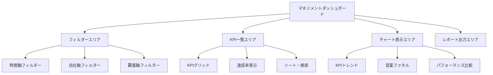

#### 6.1.2 KPI一覧テーブル設計
| 項目 | 表示内容 | ソート | フィルター | 権限 |
|------|----------|--------|------------|------|
| 架電数 | 当日・累計・目標 | ✅ | 期間・担当者 | マネージャーのみ |
| 通電数 | 通電率・件数 | ✅ | 期間・担当者 | マネージャーのみ |
| アポ獲得数 | 獲得率・件数 | ✅ | 期間・担当者 | マネージャーのみ |
| 訪問数 | 実施率・件数 | ✅ | 期間・担当者 | マネージャーのみ |
| 商談数 | 進行中・完了 | ✅ | 期間・担当者 | マネージャーのみ |
| 商談単価 | 平均・合計 | ✅ | 期間・商材 | マネージャーのみ |
| 受注件数 | 件数・受注率 | ✅ | 期間・担当者 | マネージャーのみ |
| 受注単価 | 平均・合計 | ✅ | 期間・商材 | マネージャーのみ |
| 失注件数 | 件数・失注率 | ✅ | 期間・理由 | マネージャーのみ |

### 6.2 分析軸フィルター設計

#### 6.2.1 フィルター構成
```jsx
<Space direction="vertical" size="middle">
  <Card title="分析フィルター">
    <Row gutter={16}>
      <Col span={6}>
        <Form.Item label="期間">
          <RangePicker 
            maxDate={dayjs().subtract(1, 'year')}
            placeholder={['開始日', '終了日']} 
          />
        </Form.Item>
      </Col>
      <Col span={6}>
        <Form.Item label="部署">
          <Select
            mode="multiple"
            placeholder="部署選択"
            options={departmentOptions}
          />
        </Form.Item>
      </Col>
      <Col span={6}>
        <Form.Item label="担当者">
          <Select
            mode="multiple"
            placeholder="担当者選択"
            options={userOptions}
          />
        </Form.Item>
      </Col>
      <Col span={6}>
        <Form.Item label="分析軸">
          <Select 
            defaultValue="average"
            options={[
              { value: 'average', label: '平均値' },
              { value: 'median', label: '中央値' },
              { value: 'top5', label: '上位5人' },
              { value: 'bottom5', label: '下位5人' }
            ]}
          />
        </Form.Item>
      </Col>
    </Row>
  </Card>
</Space>
```

---

## 7. 訪問管理画面設計

### 7.1 画面レイアウト構成

#### 7.1.1 2ペイン構成
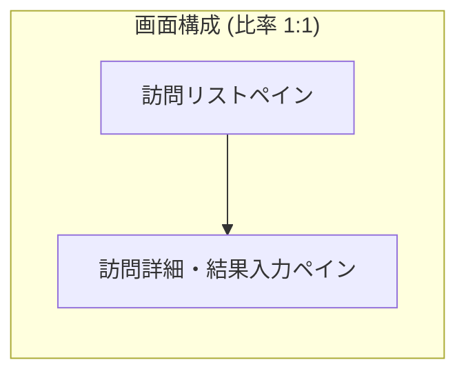

#### 7.1.2 訪問リスト表示
```jsx
<List
  dataSource={visitList}
  renderItem={(visit) => (
    <List.Item
      onClick={() => setSelectedVisit(visit)}
      className={selectedVisit?.id === visit.id ? 'selected' : ''}
    >
      <List.Item.Meta
        avatar={
          <Badge 
            status={getVisitStatusBadge(visit.status)} 
            text={visit.status}
          />
        }
        title={
          <Space>
            <Text strong>{visit.company}</Text>
            <Tag color={getPriorityColor(visit.priority)}>
              {visit.priority}
            </Tag>
          </Space>
        }
        description={
          <div>
            <div>予定: {visit.scheduledDate}</div>
            <div>担当: {visit.contact} | 目的: {visit.purpose}</div>
          </div>
        }
      />
    </List.Item>
  )}
/>
```

### 7.2 訪問結果入力フォーム

#### 7.2.1 入力フィールド設計
| フィールド | 入力形式 | 必須 | 説明 |
|------------|----------|------|------|
| 訪問日時 | 日時ピッカー | ✅ | 実際の訪問日時 |
| 訪問結果 | ラジオボタン | ✅ | 実施/キャンセル/延期 |
| 参加者 | テキスト | - | 先方参加者名 |
| 商談発生 | スイッチ | ✅ | 商談に発展したか |
| ヒアリング内容 | テキストエリア | - | 訪問内容・成果 |
| 次回アクション | セレクト | - | 商談/再訪問/提案書 |
| 次回予定日 | 日付ピッカー | - | フォローアップ予定 |

---

## 8. 商談管理画面設計

### 8.1 画面レイアウト構成

#### 8.1.1 商談リスト・詳細構成
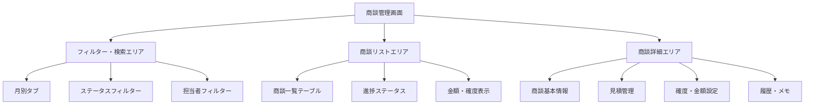

### 8.2 商談詳細編集フォーム

#### 8.2.1 商談情報入力
```jsx
<Form layout="vertical">
  <Row gutter={16}>
    <Col span={12}>
      <Form.Item label="商談名" required>
        <Input placeholder="商談タイトル" />
      </Form.Item>
    </Col>
    <Col span={12}>
      <Form.Item label="商談ステータス" required>
        <Select
          options={[
            { value: 'active', label: '進行中' },
            { value: 'estimate_sent', label: '見積提出' },
            { value: 'under_review', label: '検討中' },
            { value: 'negotiating', label: '条件調整' },
            { value: 'closed_won', label: '受注' },
            { value: 'closed_lost', label: '失注' }
          ]}
        />
      </Form.Item>
    </Col>
  </Row>
  
  <Row gutter={16}>
    <Col span={8}>
      <Form.Item label="見積金額">
        <InputNumber
          formatter={value => `¥ ${value}`.replace(/\B(?=(\d{3})+(?!\d))/g, ',')}
          parser={value => value.replace(/¥\s?|(,*)/g, '')}
        />
      </Form.Item>
    </Col>
    <Col span={8}>
      <Form.Item label="受注確度（%）" required>
        <Slider
          marks={{
            0: '0%',
            25: '25%',
            50: '50%',
            75: '75%',
            100: '100%'
          }}
          step={5}
        />
      </Form.Item>
    </Col>
    <Col span={8}>
      <Form.Item label="受注見込み金額">
        <InputNumber
          value={estimatedAmount * probability / 100}
          disabled
          formatter={value => `¥ ${value}`.replace(/\B(?=(\d{3})+(?!\d))/g, ',')}
        />
      </Form.Item>
    </Col>
  </Row>
</Form>
```

---

## 9. 受注履歴画面設計

### 9.1 画面レイアウト構成

#### 9.1.1 月別受注実績表示
```jsx
<Card title="受注履歴">
  <Row gutter={16} style={{ marginBottom: 16 }}>
    <Col span={8}>
      <Statistic 
        title="今月の受注件数" 
        value={monthlyOrders.count} 
        suffix="件"
      />
    </Col>
    <Col span={8}>
      <Statistic 
        title="今月の受注金額" 
        value={monthlyOrders.amount} 
        formatter={value => `¥${value}`.replace(/\B(?=(\d{3})+(?!\d))/g, ',')}
      />
    </Col>
    <Col span={8}>
      <Statistic 
        title="平均受注単価" 
        value={monthlyOrders.avgAmount} 
        formatter={value => `¥${value}`.replace(/\B(?=(\d{3})+(?!\d))/g, ',')}
      />
    </Col>
  </Row>
  
  <Table
    dataSource={orderHistory}
    columns={orderColumns}
    pagination={{ pageSize: 20 }}
    rowSelection={{
      type: 'checkbox',
      onChange: setSelectedOrders
    }}
  />
</Card>
```

### 9.2 商材別分析表示

#### 9.2.1 商材別受注グラフ
```jsx
<Card title="商材別受注分析">
  <Pie
    data={{
      labels: productLabels,
      datasets: [{
        data: productOrderAmounts,
        backgroundColor: [
          '#1890ff', '#52c41a', '#faad14', 
          '#f5222d', '#722ed1', '#13c2c2'
        ]
      }]
    }}
    options={{
      responsive: true,
      plugins: {
        legend: { position: 'right' },
        tooltip: {
          callbacks: {
            label: (context) => `${context.label}: ¥${context.parsed.toLocaleString()}`
          }
        }
      }
    }}
  />
</Card>
```

---

## 10. AI音声認識UI設計

### 10.1 音声認識パネル設計

#### 10.1.1 音声認識コントロール
```jsx
<Card title="AI音声認識" className="voice-recognition-panel">
  <Space direction="vertical" size="large" style={{ width: '100%' }}>
    <Row justify="center">
      <Button
        type={isRecording ? 'danger' : 'primary'}
        shape="circle"
        size="large"
        icon={isRecording ? <PauseOutlined /> : <AudioOutlined />}
        onClick={toggleRecording}
        loading={isProcessing}
      >
        {isRecording ? '停止' : '録音開始'}
      </Button>
    </Row>
    
    <div className="transcript-area">
      <Text type="secondary">音声認識結果:</Text>
      <div className="transcript-text">
        {transcriptText || '音声認識を開始してください...'}
      </div>
    </div>
    
    <div className="ai-judgment-area">
      <Row gutter={16}>
        <Col span={12}>
          <Card size="small" title="通電判定">
            <Badge 
              status={aiJudgment.connection ? 'success' : 'error'}
              text={aiJudgment.connection ? '通電' : '不通'}
            />
          </Card>
        </Col>
        <Col span={12}>
          <Card size="small" title="アポ獲得判定">
            <Badge 
              status={aiJudgment.appointment ? 'success' : 'warning'}
              text={aiJudgment.appointment ? 'アポ獲得' : '未獲得'}
            />
          </Card>
        </Col>
      </Row>
    </div>
    
    <Button 
      type="link" 
      onClick={() => setShowCorrection(true)}
      disabled={!aiJudgment.hasResult}
    >
      AI判定を修正する
    </Button>
  </Space>
</Card>
```

### 10.2 AI判定修正UI

#### 10.2.1 修正フォーム
```jsx
<Modal 
  title="AI判定修正" 
  open={showCorrection}
  onOk={handleJudgmentCorrection}
  onCancel={() => setShowCorrection(false)}
>
  <Form layout="vertical">
    <Form.Item label="通電結果">
      <Radio.Group value={correctedJudgment.connection}>
        <Radio value={true}>通電</Radio>
        <Radio value={false}>不通</Radio>
      </Radio.Group>
    </Form.Item>
    
    <Form.Item label="アポ獲得結果">
      <Radio.Group value={correctedJudgment.appointment}>
        <Radio value={true}>アポ獲得</Radio>
        <Radio value={false}>アポ未獲得</Radio>
      </Radio.Group>
    </Form.Item>
    
    <Form.Item label="修正理由">
      <TextArea 
        placeholder="修正した理由を入力してください"
        rows={3}
      />
    </Form.Item>
  </Form>
</Modal>
```

---

## 11. レスポンシブ対応

### 11.1 ブレークポイント定義
```css
/* デスクトップ（推奨） */
@media (min-width: 1200px) {
  .container { max-width: 1140px; }
}

/* タブレット（対応） */
@media (max-width: 1199px) and (min-width: 768px) {
  .container { max-width: 720px; }
  .call-support-layout { flex-direction: column; }
}

/* モバイル（未対応）*/
@media (max-width: 767px) {
  .unsupported-message { display: block; }
}
```

### 11.2 画面サイズ別レイアウト

#### 11.2.1 デスクトップ表示（1920×1080）
- サイドメニュー: 固定表示（240px幅）
- メインコンテンツ: 残り全幅使用
- KPIカード: 4列グリッド表示
- 架電支援: 3ペイン横並び表示

#### 11.2.2 タブレット表示（1024×768）
- サイドメニュー: 折りたたみ可能
- KPIカード: 2列グリッド表示
- 架電支援: ペイン縦積み表示
- フォント: 1段階大きく調整

---

## 12. 状態別表示パターン

### 12.1 ローディング状態

#### 12.1.1 スケルトン表示パターン
```jsx
// KPIカードスケルトン
<Card>
  <Skeleton.Avatar active size="large" />
  <Skeleton active paragraph={{ rows: 2 }} />
</Card>

// テーブルスケルトン
<Table
  dataSource={[]}
  loading={{
    spinning: true,
    indicator: <LoadingOutlined spin />,
    tip: "データを読み込み中..."
  }}
/>
```

#### 12.1.2 プログレス表示
```jsx
<Progress
  percent={loadingProgress}
  status="active"
  format={(percent) => `${percent}% 読み込み中`}
/>
```

### 12.2 エラー状態表示

#### 12.2.1 エラーメッセージパターン
| エラー種別 | アイコン | メッセージ | アクション |
|------------|----------|------------|------------|
| データ取得失敗 | ⚠️ | データの取得に失敗しました | 再読み込み |
| ネットワークエラー | 🌐 | ネットワークに接続できません | 再試行 |
| 入力エラー | ❌ | 入力内容に誤りがあります | 修正 |

#### 12.2.2 Empty状態
```jsx
<Empty
  image={Empty.PRESENTED_IMAGE_SIMPLE}
  description="架電対象がありません"
>
  <Button type="primary">新規追加</Button>
</Empty>
```

### 12.3 成功・完了状態

#### 12.3.1 成功通知
```jsx
// 架電結果保存成功
notification.success({
  message: '架電結果を保存しました',
  description: '次の架電対象に移りましょう',
  duration: 3,
});

// KPI達成通知
notification.success({
  message: '🎉 目標達成おめでとうございます！',
  description: '今日の架電目標15件を達成しました',
  duration: 5,
});
```

---

## 13. コンポーネント仕様

### 13.1 主要コンポーネント一覧

| コンポーネント名 | 責務 | Props | Events |
|------------------|------|-------|--------|
| `KPICard` | KPI表示カード | `title`, `value`, `target`, `percentage` | `onDetail` |
| `TodoList` | 行動指示リスト | `todos`, `loading` | `onAction`, `onComplete` |
| `CallList` | 架電対象リスト | `customers`, `filters` | `onSelect`, `onFilter` |
| `CustomerPanel` | 顧客詳細表示 | `customer`, `history` | - |
| `CallForm` | 架電結果入力 | `customer`, `onSubmit` | `onSave`, `onCancel` |

### 13.2 機能拡張版コンポーネント

#### 13.2.1 拡張版コンポーネント一覧
| コンポーネント名 | 責務 | Props | Events |
|------------------|------|-------|--------|
| `ManagementDashboard` | マネジメントKPI表示 | `kpiData`, `filters` | `onFilterChange` |
| `KPIGrid` | KPI一覧テーブル | `data`, `sortable` | `onSort`, `onFilter` |
| `VisitList` | 訪問対象リスト | `visits`, `filters` | `onSelect`, `onStatusChange` |
| `NegotiationDetail` | 商談詳細編集 | `negotiation`, `editable` | `onSave`, `onCancel` |
| `OrderHistory` | 受注履歴表示 | `orders`, `period` | `onExport` |
| `VoiceRecognition` | AI音声認識 | `onTranscript`, `onJudgment` | `onCorrection` |

#### 13.2.2 PriorityTag
```jsx
interface PriorityTagProps {
  priority: 'urgent' | 'high' | 'medium' | 'low';
  text?: string;
}

const PriorityTag: React.FC<PriorityTagProps> = ({ priority, text }) => {
  const config = {
    urgent: { color: 'red', icon: <FireOutlined /> },
    high: { color: 'orange', icon: <ThunderboltOutlined /> },
    medium: { color: 'blue', icon: <FileTextOutlined /> },
    low: { color: 'default', icon: <EditOutlined /> }
  };
  
  return (
    <Tag color={config[priority].color} icon={config[priority].icon}>
      {text || priority}
    </Tag>
  );
};
```

#### 13.2.3 StatusIndicator
```jsx
interface StatusIndicatorProps {
  status: 'success' | 'warning' | 'error' | 'info';
  text: string;
  showIcon?: boolean;
}
```

---

## 14. 実装ガイドライン

### 14.1 開発規約

#### 14.1.1 コンポーネント命名規則
- **PascalCase**: コンポーネント名（例: `CallList`, `KPICard`）
- **camelCase**: props、関数名（例: `onSelect`, `customerData`）
- **kebab-case**: CSS クラス名（例: `kpi-card`, `call-list-item`）

#### 14.1.2 ファイル構成規則（機能拡張版）
```
components/
├── common/          # 再利用可能コンポーネント
├── kpi/            # KPI関連コンポーネント
├── call/           # 架電関連コンポーネント
├── management/     # マネジメントダッシュボード
├── visit/          # 訪問管理コンポーネント
├── negotiation/    # 商談管理コンポーネント
├── order/          # 受注管理コンポーネント
├── voice/          # AI音声認識コンポーネント
└── layout/         # レイアウトコンポーネント
```

#### 14.1.3 ファイル構成規則（旧版）
```
components/
├── common/          # 再利用可能コンポーネント
├── kpi/            # KPI関連コンポーネント
├── call/           # 架電関連コンポーネント
└── layout/         # レイアウトコンポーネント
```

### 14.2 パフォーマンス考慮事項

#### 14.2.1 最適化ポイント
- **仮想化**: 長いリスト表示時はVirtual Scrolling適用
- **メモ化**: React.memo、useMemo、useCallbackの適切な使用
- **遅延読み込み**: 非同期コンポーネントローディング
- **バンドル分割**: ページ単位でのCode Splitting

#### 14.2.2 レンダリング最適化
```jsx
// 例: CallListの最適化
const CallList = React.memo(({ customers, onSelect }) => {
  const memoizedCustomers = useMemo(
    () => customers.filter(customer => customer.active),
    [customers]
  );
  
  const handleSelect = useCallback((customer) => {
    onSelect(customer);
  }, [onSelect]);
  
  return (
    <VirtualList
      data={memoizedCustomers}
      itemHeight={80}
      renderItem={({ item }) => (
        <CallListItem 
          customer={item} 
          onSelect={handleSelect}
        />
      )}
    />
  );
});
```

### 14.3 アクセシビリティ対応

#### 14.3.1 キーボード操作対応
| 操作 | ショートカット | 機能 |
|------|----------------|------|
| 次の項目 | Tab / ↓ | フォーカス移動 |
| 前の項目 | Shift+Tab / ↑ | フォーカス移動 |
| 実行 | Enter / Space | 選択・実行 |
| キャンセル | Escape | 操作キャンセル |

#### 14.3.2 ARIA属性設定
```jsx
<div
  role="tabpanel"
  aria-labelledby="kpi-tab"
  aria-describedby="kpi-description"
  tabIndex={0}
>
  {/* KPIコンテンツ */}
</div>
```

---

## 📅 更新履歴

| 日付 | バージョン | 更新内容 | 更新者 |
|------|------------|----------|--------|
| 2025/01/24 | v1.0 | 初版作成（モック版） | システム設計チーム |
| 2025/01/24 | v2.0 | 機能拡張版対応（マネジメント・訪問・商談・受注・AI音声認識画面追加） | システム設計チーム |

---

**次回見直し予定**: 機能拡張版完了時
**関連ドキュメント**: 
- [001_frontend_design_mock.md](./001_frontend_design_mock.md)
- [004_requirements_mock.md](./004_requirements_mock.md)
- [002_database_design.md](./002_database_design.md)
- [006_demo_guide.md](./006_demo_guide.md) 