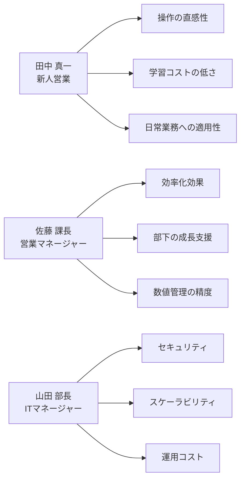
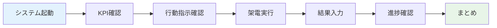
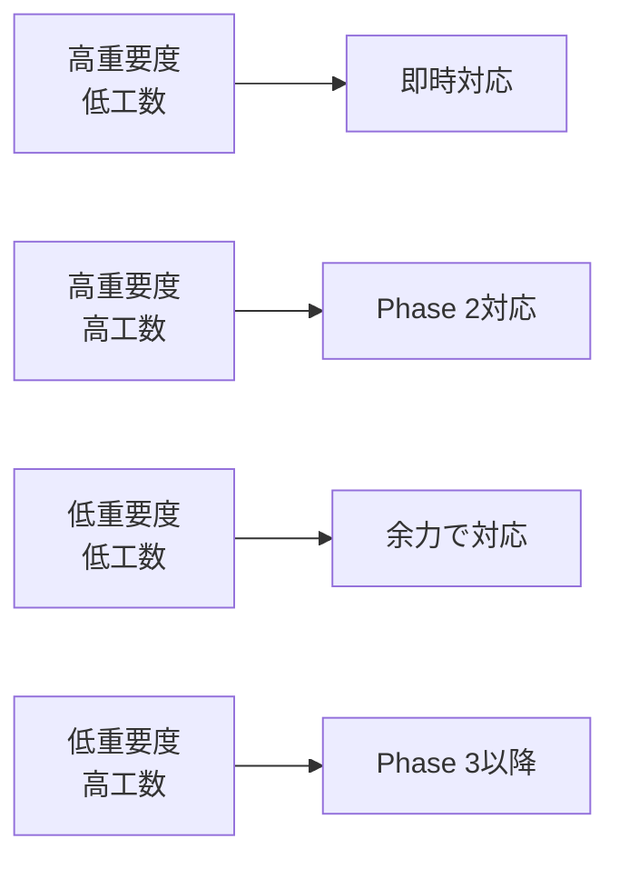
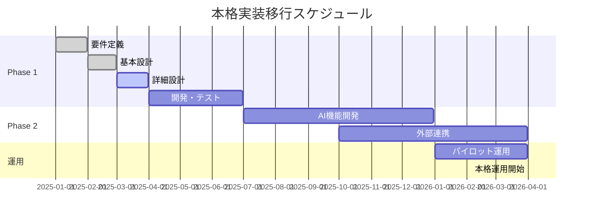

# 営業サポートAI デモ・評価手順書 v3.0

**ドキュメント管理情報**
- 作成日：2025年1月24日
- 最終更新日：2025年1月24日
- バージョン：v3.0（実装状況反映版）
- 対象：実装済み機能（約85%完了）のデモ・評価
- 実装済み画面：KPI・架電・訪問・マネジメント

---

## 📑 目次

1. [デモ概要](#1-デモ概要)
2. [事前準備](#2-事前準備)
3. [デモシナリオ](#3-デモシナリオ)
4. [評価観点・基準](#4-評価観点基準)
5. [環境構築手順](#5-環境構築手順)
6. [想定Q&A](#6-想定qa)
7. [評価レポート](#7-評価レポート)
8. [次フェーズ計画](#8-次フェーズ計画)

---

## 1. デモ概要

### 1.1 実装済み機能デモの目的
- **営業フロー検証**: 架電→訪問の統合管理効果確認（実装済み）
- **詳細機能実証**: BANTC情報・活動履歴・顧客詳細管理の実用性評価
- **マネジメント機能検証**: 10項目KPIの多軸分析機能の有効性確認（実装済み）
- **UI/UX評価**: 実際の営業現場を想定した操作性・直感性の確認
- **追加実装検討**: 商談・受注専用画面の必要性と仕様検討

### 1.2 対象者・役割

#### 1.2.1 機能拡張版参加者マトリクス
| 参加者 | 役割 | 評価観点 | 所要時間 |
|--------|------|----------|----------|
| **営業マネージャー** | 意思決定者 | マネジメント機能・ROI効果 | 90分 |
| **営業担当者** | エンドユーザー | 営業フロー統合・AI音声認識 | 75分 |
| **ITマネージャー** | 技術責任者 | 権限管理・システム拡張性 | 60分 |
| **開発チーム** | 実装担当 | 技術仕様・パフォーマンス | 120分 |

#### 1.2.2 評価者ペルソナ


### 1.3 デモ環境仕様
- **実行環境**: Windows 10/11 + Chrome/Edge/Safari
- **画面解像度**: 1920×1080（推奨）、1366×768（最小）
- **ネットワーク**: ローカル実行（インターネット不要）
- **データ**: 実際の営業データに近いサンプルデータ使用

---

## 2. 事前準備

### 2.1 デモ環境セットアップ

#### 2.1.1 システム要件確認
```powershell
# Node.js バージョン確認
node --version  # v18.0.0以上必要

# npm バージョン確認  
npm --version   # v9.0.0以上必要

# Git バージョン確認
git --version   # v2.30.0以上推奨
```

#### 2.1.2 プロジェクト起動手順（実装済み版）
```powershell
# 1. プロジェクトディレクトリへ移動
cd sales-ai-mock

# 2. 依存関係のインストール
npm install

# 3. 開発サーバー起動
npm run dev

# 4. ブラウザでアクセス
# http://localhost:5173

# 実装済み機能確認
# ✅ KPIダッシュボード (/)
# ✅ 架電支援画面 (/call)  
# ✅ 訪問管理画面 (/visit)
# ✅ マネジメント画面 (/management)
```

### 2.2 実装済み機能デモシナリオ（30分コース）

#### シナリオ1: KPI確認・目標管理（5分）
1. KPIダッシュボード（/）にアクセス
2. 今日の目標達成状況を確認
3. ToDoリストで優先度の高いタスクを確認
4. 次アクション「高優先度架電」をクリックして架電画面へ遷移

#### シナリオ2: 架電活動・詳細管理（15分）
1. 架電支援画面（/call）で優先度順リストを確認
2. 企業名をクリックして顧客詳細モーダルを表示
3. BANTC情報（AIたたき台+自由記入）を確認・編集
4. 活動履歴タブで過去1年分の活動を時系列確認
5. 通話録音タブで音声認識モック機能を体験
6. 架電結果を「アポ獲得」で記録・保存

#### シナリオ3: 訪問管理・商談連携（5分）
1. 訪問管理画面（/visit）でアポ獲得済み企業を確認
2. 訪問結果を「訪問成功」「商談発生あり」で記録
3. 商談設定フラグの自動連携を確認

#### シナリオ4: マネジメント分析（5分）
1. マネジメント画面（/management）で10項目KPI確認
2. 部署別・担当者別フィルターで多軸分析を体験
3. 時系列トレンドとクロス集計を確認
4. CSV出力機能（将来実装）の説明

#### 2.1.3 デモ用データ準備
```json
// src/data/demo-data.json
{
  "kpis": {
    "daily": {
      "callTarget": 15,
      "callCurrent": 8,
      "proposalTarget": 2,
      "proposalCurrent": 1
    },
    "monthly": {
      "orderTarget": 2,
      "orderCurrent": 0,
      "revenueTarget": 5000000,
      "revenueCurrent": 0
    }
  },
  "customers": [
    {
      "id": 1,
      "company": "株式会社ABC",
      "name": "田中 太郎",
      "priority": "urgent",
      "lastContact": "2025/01/20",
      "purpose": "システム更新の提案"
    }
  ]
}
```

### 2.2 デモ資料準備

#### 2.2.1 必要資料一覧
- [ ] **システム概要スライド** (5分用・10分用)
- [ ] **操作ガイド** (画面キャプチャ付き)
- [ ] **評価シート** (印刷用・デジタル用)
- [ ] **想定Q&A集** (よくある質問対応)
- [ ] **技術仕様書** (IT担当者向け)

#### 2.2.2 デモスクリプト例
```markdown
## 導入（2分）
「本日は貴重なお時間をいただき、ありがとうございます。
営業サポートAIシステムのモックアップ版をご紹介させていただきます。」

## システム概要説明（3分）
「こちらのシステムは、営業活動の効率化を目的として...」

## 実演（15分）
「それでは実際に操作をご覧いただきます...」
```

---

## 3. デモシナリオ

### 3.1 メインシナリオ（標準版：20分）

#### 3.1.1 シナリオ流れ


#### 3.1.2 詳細手順
| ステップ | 操作内容 | 説明内容 | 所要時間 |
|----------|----------|----------|----------|
| **1. ログイン・概要** | ブラウザでアクセス | 「田中さんとしてログインします」 | 1分 |
| **2. KPI確認** | ダッシュボード表示 | 「今日の目標と進捗を確認できます」 | 3分 |
| **3. 行動指示** | ToDoリスト確認 | 「AIが優先度付けした行動リストです」 | 2分 |
| **4. 架電実行** | 架電支援画面遷移 | 「架電対象の詳細情報を確認できます」 | 5分 |
| **5. 結果入力** | 架電結果フォーム | 「簡単入力で履歴が蓄積されます」 | 4分 |
| **6. 進捗確認** | ダッシュボード更新 | 「リアルタイムで進捗が更新されます」 | 2分 |
| **7. Q&A・まとめ** | 質疑応答 | フィードバック収集 | 3分 |

### 3.2 シナリオ詳細（営業担当者向け）

#### 3.2.1 新人営業担当者「田中真一」のストーリー
```
**背景設定**
営業1年目の田中さんが、朝一番にシステムにアクセスし、
今日やるべき営業活動を確認するシーン

**デモストーリー**
1. 「おはようございます。田中さんが出社して最初にすることは...」
2. 「システムにアクセスして今日の目標確認」
3. 「KPIダッシュボードで、架電15件、提案2件の目標を確認」
4. 「現在8件架電済み、あと7件で目標達成」
5. 「優先度の高い架電対象を確認」
6. 「株式会社ABCの田中様への架電を実行」
7. 「通話後、結果を簡単入力」
8. 「進捗がリアルタイムで更新されることを確認」
```

#### 3.2.2 実演操作手順
```markdown
### KPI確認フェーズ（3分）
1. ダッシュボードアクセス
   - 「今日の目標：架電15件、現在8件（53%達成）」
   - 「視覚的に進捗がわかりやすい設計」
   
2. 達成状況確認
   - 「緑：達成、黄：注意、赤：未達成の色分け」
   - 「一目で状況を把握できます」

### 行動指示フェーズ（2分）
1. ToDoリスト確認
   - 「AIが分析した優先度順のリスト」
   - 「緊急度の高い案件から表示」
   
2. 次のアクション確認
   - 「何をすべきか迷わない設計」
   - 「クリック一つで詳細画面に移動」

### 架電実行フェーズ（5分）
1. 顧客リスト表示
   - 「優先度、最終架電日で絞り込み可能」
   - 「効率的な架電ルート作成」
   
2. 顧客詳細確認
   - 「過去の架電履歴を時系列で表示」
   - 「前回の会話内容を事前確認」
   
3. 架電実行
   - 「架電ボタンクリックで通話開始」
   - 「通話時間の自動計測」

### 結果入力フェーズ（4分）
1. 通話結果選択
   - 「接続/不在/拒否から選択」
   - 「ワンクリックで基本情報入力」
   
2. 詳細情報入力
   - 「ヒアリング内容、次回アクション」
   - 「音声入力も対応予定」
   
3. 保存・更新
   - 「保存と同時にKPI更新」
   - 「次の架電対象に自動移動」
```

### 3.3 機能拡張版シナリオ

#### 3.3.1 マネジメントダッシュボードシナリオ（20分）
```markdown
**対象**: マネージャー向け
**目的**: 10項目KPIの多軸分析とレポート機能評価

**デモフロー**
1. マネジメントダッシュボードアクセス
   - 「全社のKPI一覧をテーブル表示」
   - 「架電数、通電数、アポ獲得数、訪問数、商談数等の実績確認」

2. 分析軸フィルター操作
   - 「期間フィルター：過去3ヶ月のデータ表示」
   - 「部署フィルター：営業部のみ選択」
   - 「担当者フィルター：上位5人の実績表示」

3. チャート・グラフ表示
   - 「KPIトレンドグラフで推移確認」
   - 「営業ファネルで各工程の通過率可視化」
   - 「部署別パフォーマンス比較」

4. レポート出力
   - 「CSV形式でのデータ出力」
   - 「月次レポートの自動生成」
```

#### 3.3.2 AI音声認識シナリオ（15分）
```markdown
**対象**: 営業担当者向け
**目的**: AI自動判定と手動修正の実用性評価

**デモフロー**
1. 架電画面でAI音声認識開始
   - 「音声録音ボタンで通話内容録音」
   - 「リアルタイムでの音声→テキスト変換」

2. AI自動判定結果確認
   - 「通電判定：○ 通電」
   - 「アポ獲得判定：○ アポ獲得（次回話し合い約束）」
   - 「信頼度表示：88%」

3. 手動修正機能
   - 「AI判定に誤りがある場合の修正操作」
   - 「修正理由の入力」
   - 「修正内容の保存」

4. 架電結果への自動反映
   - 「AI判定結果が架電結果フォームに自動入力」
   - 「手動での最終確認・微調整」
```

#### 3.3.3 営業フロー統合シナリオ（25分）
```markdown
**対象**: 営業担当者向け
**目的**: 架電→訪問→商談→受注の一気通貫管理評価

**デモフロー**
1. 架電成功（アポ獲得）
   - 「架電でアポ獲得」
   - 「自動的に訪問管理画面にデータ連携」

2. 訪問管理画面
   - 「アポ獲得済み顧客が訪問リストに自動表示」
   - 「訪問予定日時・場所の設定」
   - 「訪問結果入力：商談発生フラグ ON」

3. 商談管理画面
   - 「訪問結果から商談リストへ自動追加」
   - 「商談詳細：要件・見積金額・受注確度の設定」
   - 「受注見込み金額の自動計算（確度×見積金額）」

4. 受注履歴画面
   - 「商談成功時の受注データ自動生成」
   - 「月別受注実績の集計表示」
   - 「商材別分析グラフ」

5. データ連携確認
   - 「各工程のデータが適切に連携されていることを確認」
   - 「KPIダッシュボードでの実績反映確認」
```

### 3.4 役職別シナリオ（機能拡張版）

#### 3.4.1 営業マネージャー向け（30分）
```markdown
**フォーカスポイント**
- マネジメントダッシュボードの分析機能
- チーム全体のKPI管理
- レポート出力・意思決定支援

**デモ内容**
1. 全社KPI一覧の確認
2. 部署別・担当者別パフォーマンス比較
3. 営業ファネル分析とボトルネック特定
4. 過去1年間のトレンド分析
5. CSV形式でのレポート出力
6. 権限管理：全社データ閲覧の確認
```

#### 3.4.2 営業担当者向け（30分）
```markdown
**フォーカスポイント**
- 営業フロー統合の操作性
- AI音声認識の実用性
- 日常業務の効率化効果

**デモ内容**
1. KPI指示だし→架電→AI音声認識の一連操作
2. アポ獲得→訪問管理→商談管理の流れ
3. 商談詳細入力と受注確度設定
4. 受注成功時の自動データ連携
5. 権限管理：個人データのみ閲覧の確認
```

#### 3.4.3 ITマネージャー向け（20分）
```markdown
**フォーカスポイント**
- 権限管理システム
- データセキュリティ
- システム拡張性・パフォーマンス

**デモ内容**
1. ユーザー権限別画面アクセス制御
2. 大量データでのパフォーマンス確認
3. 営業フロー間のデータ整合性
4. 本格実装時の技術的課題
5. AI音声認識の精度と修正機能
```

---

## 4. 評価観点・基準

### 4.1 UI/UX評価基準

#### 4.1.1 ユーザビリティ評価項目
| 評価項目 | 評価基準 | 配点 | 評価方法 |
|----------|----------|------|----------|
| **直感性** | 初見で操作方法がわかる | 25点 | 初回操作時の迷い度合い |
| **効率性** | 目的達成までの操作数 | 25点 | タスク完了時間測定 |
| **学習容易性** | 2回目以降の操作向上 | 20点 | 操作時間の短縮率 |
| **エラー回避** | 誤操作の発生頻度 | 15点 | エラー発生回数 |
| **満足度** | 継続利用意向 | 15点 | アンケート評価 |

#### 4.1.2 評価スケール
```
5点: 非常に良い（期待を大きく上回る）
4点: 良い（期待を上回る）  
3点: 普通（期待通り）
2点: 悪い（期待を下回る）
1点: 非常に悪い（期待を大きく下回る）
```

### 4.2 機能実現度チェックリスト

#### 4.2.1 必須機能（Phase 1）
- [ ] **KPI可視化**
  - [ ] 日次・月次目標表示
  - [ ] 達成率の視覚的表示
  - [ ] 進捗状況のリアルタイム更新
  
- [ ] **行動指示だし**
  - [ ] 優先度付きToDoリスト
  - [ ] 次回アクション提案
  - [ ] 架電対象の絞り込み・ソート
  
- [ ] **架電支援**
  - [ ] 顧客情報の一覧・詳細表示
  - [ ] 架電履歴の時系列表示
  - [ ] 架電結果の簡単入力

- [ ] **データ管理**
  - [ ] 顧客情報の CRUD操作
  - [ ] 架電履歴の蓄積・検索
  - [ ] データの永続化（ローカルストレージ）

#### 4.2.2 期待機能（Phase 2以降）
- [ ] **AI分析機能**
  - [ ] 成約予測・優先度自動算出
  - [ ] 提案タイミング推奨
  - [ ] パフォーマンス分析
  
- [ ] **外部連携**
  - [ ] CRM・SFAとのデータ連携
  - [ ] メール・カレンダー連携
  - [ ] 電話システム連携

### 4.3 技術的評価観点

#### 4.3.1 性能・品質指標
| 項目 | 目標値 | 測定方法 | 許容範囲 |
|------|--------|----------|----------|
| **初期ロード時間** | 3秒以内 | DevTools Network | 5秒まで許容 |
| **操作レスポンス** | 1秒以内 | ユーザー操作〜画面更新 | 2秒まで許容 |
| **メモリ使用量** | 100MB以下 | DevTools Memory | 200MBまで許容 |
| **バンドルサイズ** | 2MB以下 | ビルド結果 | 5MBまで許容 |

#### 4.3.2 ブラウザ互換性
| ブラウザ | バージョン | 必須対応 | 動作確認 |
|----------|------------|----------|----------|
| Chrome | 最新版 | ✅ | ✅ |
| Edge | 最新版 | ✅ | ✅ |
| Safari | 最新版 | ✅ | ✅ |
| Firefox | 最新版 | - | - |

---

## 5. 環境構築手順

### 5.1 評価者向けセットアップガイド

#### 5.1.1 必要なソフトウェア
```markdown
## 事前準備（評価者向け）

### 1. Node.js インストール
1. https://nodejs.org/ にアクセス
2. 「LTS版」をダウンロード・インストール
3. インストール完了後、PowerShellを開く
4. `node --version` でバージョン確認

### 2. Git インストール（オプション）
1. https://git-scm.com/ にアクセス
2. Windows版をダウンロード・インストール
3. `git --version` でバージョン確認

### 3. ブラウザ準備
- Chrome、Edge、Safariのうち最新版を用意
- 開発者ツール使用のため、Chrome推奨
```

#### 5.1.2 簡単起動手順（評価者向け）
```powershell
# 1. プロジェクトフォルダに移動
cd /path/to/sales-ai-demo

# 2. 初回のみ：依存関係インストール
npm install

# 3. アプリケーション起動
npm run dev

# 4. ブラウザでアクセス
# 自動的にブラウザが開く（開かない場合は手動で http://localhost:5173 にアクセス）

# 5. 停止する場合
# Ctrl + C でサーバー停止
```

### 5.2 トラブルシューティング

#### 5.2.1 よくある問題と解決方法
| 問題 | 原因 | 解決方法 |
|------|------|----------|
| `npm command not found` | Node.js未インストール | Node.jsを公式サイトからインストール |
| `Permission denied` | 権限不足 | 管理者権限でPowerShell実行 |
| `Port 5173 already in use` | ポート競合 | 他のアプリケーションを終了、または `npm run dev -- --port 3000` |
| 画面が真っ白 | JavaScriptエラー | F12でDevToolsを開き、Consoleタブでエラー確認 |

#### 5.2.2 緊急時対応
```markdown
## すぐに動作確認したい場合

### 方法1: 配布済みビルド版を使用
1. `dist/` フォルダの index.html をブラウザで直接開く
2. ファイルプロトコルでの実行（機能制限あり）

### 方法2: オンラインデモ使用
1. [デモサイトURL] にアクセス
2. インターネット接続必須

### 方法3: 事前準備済み端末使用
1. 会議室の準備済みPCを使用
2. デスクトップの「営業AI デモ」アイコンをダブルクリック
```

### 5.3 デモ用データセット

#### 5.3.1 サンプルデータ内容
```json
{
  "demoData": {
    "users": [
      {
        "name": "田中 真一", 
        "role": "営業担当",
        "experience": "1年",
        "targets": { "daily": 15, "monthly": 2 }
      }
    ],
    "customers": [
      {
        "company": "株式会社ABC",
        "industry": "IT",
        "size": "中規模（100-300名）",
        "priority": "urgent",
        "status": "検討中"
      }
    ],
    "scenarios": [
      {
        "title": "新規開拓シナリオ",
        "steps": ["リスト確認", "架電実行", "ヒアリング", "提案書作成"]
      }
    ]
  }
}
```

---

## 6. 想定Q&A

### 6.1 機能・仕様に関するQ&A

#### 6.1.1 よくある質問
**Q1: 「AIはどの程度賢いのですか？」**
```
A1: 現在のモック版では、事前に設定したルールベースで優先度を算出しています。
本格実装時には、機械学習により過去の成約データから最適な架電順序や
提案タイミングを学習・予測する機能を実装予定です。

具体的には：
- 成約確率の予測（過去データ分析）
- 最適架電時間の提案（行動パターン学習）
- 提案内容の個別最適化（ニーズ分析）
```

**Q2: 「既存のCRMシステムとの連携は可能ですか？」**
```
A2: はい、可能です。本格実装時には以下の連携方法を予定しています：

技術的連携方法：
- REST API経由でのデータ同期
- CSV/Excel形式でのデータエクスポート・インポート
- Webhookによるリアルタイム連携

対応予定システム：
- Salesforce
- Microsoft Dynamics 365
- kintone
- その他汎用CRM（API提供システム）
```

**Q3: 「セキュリティ面での配慮はありますか？」**
```
A3: 以下のセキュリティ対策を実装予定です：

現在のモック版：
- ローカル実行（外部送信なし）
- データの暗号化（ローカルストレージ）

本格実装時：
- HTTPS通信の強制
- JWT認証によるアクセス制御
- データベース暗号化
- 監査ログの記録
- GDPR対応のデータ管理
```

### 6.2 技術的な質問

**Q4: 「どの程度のデータ量まで対応できますか？」**
```
A4: 
モック版：1,000件程度のサンプルデータ
本格実装時：以下を想定

- 顧客データ：10万件以上
- 架電履歴：100万件以上
- 同時接続ユーザー：100名以上
- レスポンス時間：2秒以内（90%のクエリ）

スケーラビリティ設計：
- マイクロサービス架構
- データベース分散（読み取り専用レプリカ）
- CDNによる静的ファイル配信
- オートスケーリング対応
```

**Q5: 「モバイル対応の予定はありますか？」**
```
A5: 現在のモック版はPC・タブレット対応ですが、
本格実装時にはモバイルアプリも開発予定です：

Phase 2（6ヶ月後）：
- レスポンシブWebアプリ対応
- PWA（Progressive Web App）化

Phase 3（12ヶ月後）：
- iOS/Androidネイティブアプリ
- オフライン対応
- プッシュ通知機能
```

### 6.3 運用・導入に関するQ&A

**Q6: 「導入期間・費用はどの程度ですか？」**
```
A6: 概算での想定（要詳細要件確認）：

開発期間：
- Phase 1（基本機能）：3-6ヶ月
- Phase 2（AI機能）：6-12ヶ月
- Phase 3（拡張機能）：12-18ヶ月

初期導入費用：
- システム開発：XXX万円〜
- インフラ構築：XXX万円〜
- データ移行・教育：XXX万円〜

月額運用費用：
- システム利用料：XX円/ユーザー/月
- インフラ費用：XXX万円/月
- サポート費用：XXX万円/月
```

**Q7: 「社内教育・トレーニングのサポートはありますか？」**
```
A7: はい、以下のサポートを提供予定です：

導入時サポート：
- 管理者向け設定研修（2日間）
- エンドユーザー向け操作研修（1日間）
- オンライン操作マニュアル・動画提供

継続サポート：
- ヘルプデスク（メール・電話）
- 定期的なユーザー研修会
- システム更新時の操作説明
- カスタマイズ要望への対応
```

---

## 7. 評価レポート

### 7.1 評価シートテンプレート

#### 7.1.1 総合評価表
```markdown
## 営業サポートAI デモ評価シート

### 基本情報
- 評価者名：__________________
- 所属・役職：________________
- 評価日時：__________________
- 評価環境：__________________

### 総合評価（5段階評価）
| 項目 | 評価 | コメント |
|------|------|----------|
| 全体的な印象 | □5 □4 □3 □2 □1 |  |
| 機能の有用性 | □5 □4 □3 □2 □1 |  |
| 操作のしやすさ | □5 □4 □3 □2 □1 |  |
| 画面の見やすさ | □5 □4 □3 □2 □1 |  |
| 導入意向 | □5 □4 □3 □2 □1 |  |

### 詳細評価
#### KPI指示だし機能
- 目標・進捗の見やすさ：□5 □4 □3 □2 □1
- 行動指示の有用性：□5 □4 □3 □2 □1
- データ更新の速度：□5 □4 □3 □2 □1

#### 架電支援機能  
- 顧客情報の充実度：□5 □4 □3 □2 □1
- 架電履歴の見やすさ：□5 □4 □3 □2 □1
- 結果入力の簡便性：□5 □4 □3 □2 □1

### 改善要望・コメント
__________________________________________________
__________________________________________________
__________________________________________________

### 優先的に実装してほしい機能
□ AI分析・予測機能
□ 外部システム連携
□ モバイル対応
□ 音声入力対応
□ レポート機能強化
□ その他：_______________________________
```

### 7.2 評価集計・分析

#### 7.2.1 定量評価指標
| 指標 | 測定方法 | 目標値 | 実績 |
|------|----------|--------|------|
| **総合満足度** | 5段階評価平均 | 4.0以上 | ___ |
| **導入意向** | 導入希望者割合 | 80%以上 | ___% |
| **操作完了率** | タスク成功率 | 90%以上 | ___% |
| **操作時間** | 平均完了時間 | 5分以内 | ___分 |

#### 7.2.2 定性評価まとめ
```markdown
### 高評価コメント
- 「直感的で使いやすい」
- 「営業活動が効率化されそう」
- 「数値の見える化がわかりやすい」

### 改善要望
- 「○○機能がほしい」
- 「××の操作をもっと簡単に」
- 「データの××を表示してほしい」

### 技術的課題
- セキュリティ要件の詳細確認
- 既存システムとの連携方法
- データ移行の具体的手順
```

---

## 8. 次フェーズ計画

### 8.1 フィードバック反映計画

#### 8.1.1 優先度マトリクス


#### 8.1.2 改善計画例
| フィードバック | 分類 | 対応方針 | 実装時期 |
|----------------|------|----------|----------|
| 「検索機能がほしい」 | 高重要度・低工数 | 即座に実装 | 1週間以内 |
| 「音声入力対応」 | 高重要度・高工数 | Phase 2で実装 | 6ヶ月後 |
| 「色の調整」 | 低重要度・低工数 | 次回更新で対応 | 1ヶ月以内 |
| 「AI予測精度向上」 | 低重要度・高工数 | 長期計画で検討 | 12ヶ月後 |

### 8.2 本格実装移行判断

#### 8.2.1 移行判断基準
| 判断軸 | 基準 | 現状 | 判定 |
|--------|------|------|------|
| **ユーザー満足度** | 平均4.0以上 | ___ | ○/△/× |
| **導入意向** | 80%以上 | ___% | ○/△/× |
| **技術的実現性** | 課題解決可能 | ___ | ○/△/× |
| **投資対効果** | ROI 200%以上 | ___% | ○/△/× |

#### 8.2.2 移行時スケジュール（案）


---

## 📅 更新履歴

| 日付 | バージョン | 更新内容 | 更新者 |
|------|------------|----------|--------|
| 2025/01/24 | v1.0 | 初版作成（モック版） | システム設計チーム |
| 2025/01/24 | v2.0 | 機能拡張版対応（マネジメント・AI音声認識・営業フロー統合シナリオ追加） | システム設計チーム |

---

**次回見直し予定**: 機能拡張版デモ実施後
**関連ドキュメント**: 
- [004_requirements_mock.md](./004_requirements_mock.md)
- [005_ui_design.md](./005_ui_design.md)
- [001_frontend_design_mock.md](./001_frontend_design_mock.md)
- [002_database_design.md](./002_database_design.md) 